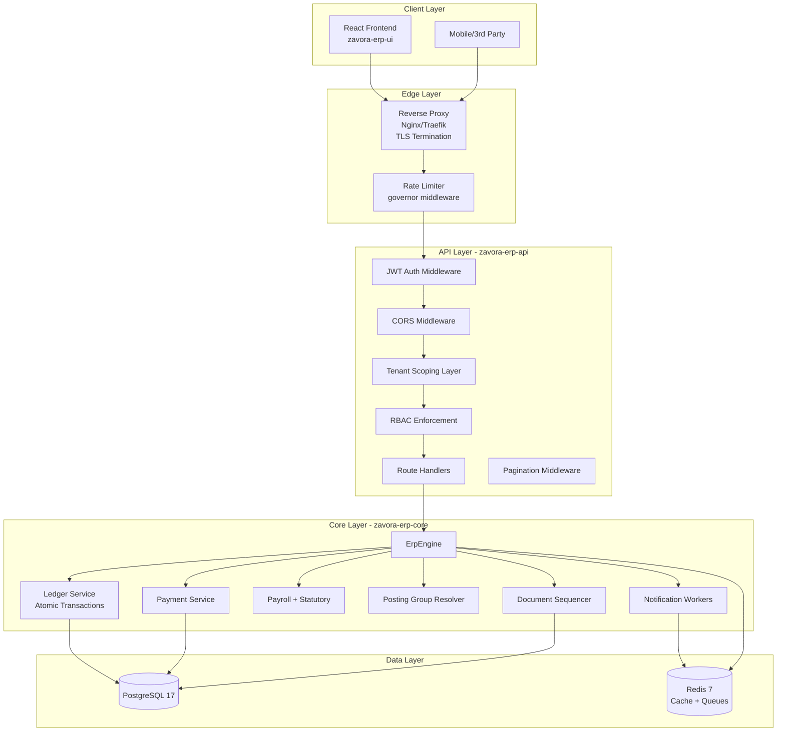
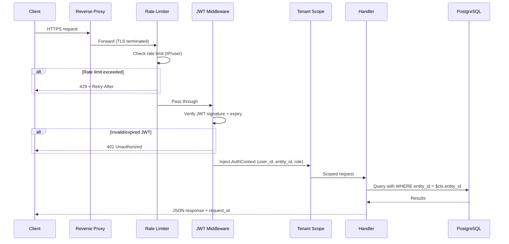
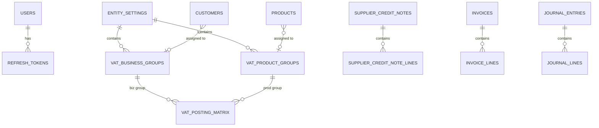

# Design Document: Production Readiness

## Overview

This design covers all 30 requirements to bring Zavora ERP from functional prototype to production-grade deployment. The changes span four layers: authentication and security, data integrity and accounting correctness, operational infrastructure, and UI completeness.

The current architecture uses header-based auth (`X-User-*`), per-process entity scoping, non-atomic multi-step ledger operations, and permissive CORS. This design replaces these with JWT-based auth, per-request tenant isolation, fully transactional ledger flows, and locked-down security — while adding posting groups, pagination, observability, and CI/CD infrastructure.

**Key design principles:**
- Backwards compatibility: existing API shape is preserved; auth moves from headers to JWT without breaking the `AuthContext` extractor interface
- Transaction safety: all ledger-coupled flows thread a single `sqlx::Transaction` through their entire operation
- Layered security: JWT verification → tenant scoping → RBAC → rate limiting
- Minimal new dependencies: leverage existing Rust ecosystem crates (`jsonwebtoken`, `argon2`, `governor`, `metrics`)

## Architecture

### High-Level System Architecture



### Request Flow (Post-JWT)



### Middleware Stack (ordered)

1. **TraceLayer** — request_id generation, span creation
2. **CorsLayer** — origin validation (env-dependent)
3. **Rate Limiter** — `governor` per-IP on public, per-user on authenticated
4. **Body Size Limit** — 10 MB max
5. **JWT Auth** — token verification, AuthContext extraction
6. **Tenant Scope** — entity_id injection into all queries

## Components and Interfaces

### 1. JWT Authentication Module (Req 1)

**New dependencies:** `jsonwebtoken = "9"`, `argon2 = "0.5"`

**Changes to `AuthContext` extractor:**
- Replace header-based extraction with JWT verification
- Extract claims from `Authorization: Bearer <token>` header
- If JWT is absent/invalid, return 401 regardless of X-User-* headers present

```rust
// New AuthContext extraction (replaces header-based)
pub struct JwtConfig {
    pub access_secret: Vec<u8>,
    pub refresh_secret: Vec<u8>,
    pub access_ttl: Duration,    // default 15 min
    pub refresh_ttl: Duration,   // default 7 days
    pub issuer: String,
}

#[derive(Debug, Serialize, Deserialize)]
pub struct Claims {
    pub sub: Uuid,        // user_id
    pub entity_id: Uuid,
    pub role: String,
    pub exp: usize,
    pub iat: usize,
    pub iss: String,
}

// Login response
pub struct TokenPair {
    pub access_token: String,
    pub refresh_token: String,
    pub expires_in: u64,
}
```

**Password hashing:** All passwords stored as Argon2id hashes. The `users` table gains a `password_hash TEXT NOT NULL` column. Login flow: hash(input) → compare with stored hash.

**Token refresh:** Refresh tokens stored in Redis with a TTL. Revocation = delete from Redis. On user deactivation, delete all refresh tokens for that user.

### 2. Transaction Atomicity Layer (Req 2)

**Core change:** Refactor `create_and_post()` to accept an optional `&mut sqlx::Transaction` parameter so callers can thread a single transaction through multi-step operations.

```rust
// New signature for transaction-aware journal posting
pub async fn create_and_post_in_tx(
    engine: &ErpEngine,
    tx: &mut sqlx::Transaction<'_, sqlx::Postgres>,
    req: CreateJournalEntryRequest,
    period_id: Uuid,
    posted_by: AgentOrUserId,
) -> ErpResult<JournalEntry>;

// Payment recording wraps everything in one transaction:
pub async fn record_payment(
    engine: &ErpEngine,
    req: RecordPaymentRequest,
    recorded_by: &AgentOrUserId,
) -> ErpResult<Payment> {
    let mut tx = engine.pool().begin().await?;
    // 1. Insert payment record (in tx)
    // 2. Update invoice/bill balances (in tx)
    // 3. Create journal entry via create_and_post_in_tx (in tx)
    // 4. Link JE to payment (in tx)
    tx.commit().await?;
    // Post-commit: FX gain/loss, audit events, reminders (best-effort)
}
```

**Affected flows:**
- `record_payment` — payment + balance updates + JE in one tx
- `post_invoice` — status change + JE + AR balance in one tx
- `create_credit_note` — CN record + reversing JE + balance in one tx
- `apply_unapplied_payment` — allocation + balance transfer + JE in one tx

### 3. Tenant Scoping (Req 3)

**Strategy:** Remove the startup `ENTITY_ID` env var as the query-scoping mechanism. Instead, every handler receives `AuthContext` from JWT middleware and passes `ctx.entity_id` to all service functions.

**Implementation:**
- Remove `engine.entity_id()` as the default scope — it becomes a fallback only for background tasks (scheduler)
- All service functions gain an `entity_id: Uuid` parameter (from ctx)
- All queries use `WHERE entity_id = $entity_id` from the parameter, not from engine config
- Cross-tenant access returns 404 (not 403) to prevent information leakage
- Database-level RLS (Row Level Security) as a defence-in-depth layer (optional, phase 2)

### 4. Monetary Rounding (Req 5)

**Rounding function:**
```rust
use rust_decimal::prelude::*;

/// Round a monetary value to 2dp using banker's rounding (MidpointNearestEven)
pub fn round_money(value: Decimal) -> Decimal {
    value.round_dp_with_strategy(2, RoundingStrategy::MidpointNearestEven)
}

/// Round PAYE to nearest shilling (KRA requirement)
pub fn round_paye(value: Decimal) -> Decimal {
    value.round_dp_with_strategy(0, RoundingStrategy::MidpointNearestEven)
}
```

**VAT computation:** Apply `round_money()` to each line's VAT before summing. The invoice total VAT = Σ(round_money(line_amount × vat_rate)).

**Rounding adjustment:** After building JE lines, if |debits - credits| ≤ 0.01, insert a rounding adjustment line to a `rounding_expense` account (new field in `PostingSetup`). If imbalance > 0.01, reject as truly unbalanced.

### 5. Document Sequencer (Req 6)

**Current problem:** Numbers allocated via `UPDATE ... RETURNING` outside the document creation transaction — gaps on failure.

**Solution:** Move number allocation inside the document creation transaction using `SELECT ... FOR UPDATE` on the sequence row:

```sql
-- Atomic number allocation within the creation transaction
SELECT sequences->>'{type}_next' AS next_num
FROM entity_settings
WHERE entity_id = $1
FOR UPDATE;

-- Only after successful document insert:
UPDATE entity_settings
SET sequences = jsonb_set(sequences, '{type}_next', to_jsonb(next_num + 1))
WHERE entity_id = $1;
```

**Year reset:** On first allocation in a new fiscal year (detected by comparing current fiscal year with a stored `last_year_allocated`), reset counter to start number.

**Concurrency:** The `FOR UPDATE` lock serializes concurrent allocations within the same entity, preventing duplicates without advisory locks.

### 6. CORS Configuration (Req 7)

**Implementation:** Replace `CorsLayer::permissive()` with environment-aware CORS:

```rust
fn build_cors_layer() -> CorsLayer {
    let env = std::env::var("APP_ENV").unwrap_or_else(|_| "development".into());
    if env == "production" {
        let origins: Vec<HeaderValue> = std::env::var("CORS_ALLOWED_ORIGINS")
            .unwrap_or_default()
            .split(',')
            .filter_map(|s| s.trim().parse().ok())
            .collect();
        CorsLayer::new()
            .allow_origin(origins)
            .allow_methods([Method::GET, Method::POST, Method::PUT, Method::DELETE])
            .allow_headers([AUTHORIZATION, CONTENT_TYPE])
            .allow_credentials(true)
    } else {
        CorsLayer::permissive()
    }
}
```

### 7. M-Pesa Callback Authenticity (Req 8)

**IP allowlist:** Maintain a configurable list of Safaricom Daraja IP ranges. Validate the connecting IP (from `X-Forwarded-For` or socket addr) against this list before processing.

**Correlation:** Change M-Pesa callback processing to correlate via `CheckoutRequestID` stored during STK Push initiation (in `mpesa_transactions` table), not via client-supplied `invoice_id`.

**Idempotency:** Already implemented via unique constraint on `(entity_id, receipt_number)`. Return 200 for duplicates.

### 8. Rate Limiting (Req 22)

**Crate:** `governor = "0.7"` with `tower-governor` integration.

**Configuration:**
- Login endpoint: 10 req/min per IP (`/api/v1/auth/login`)
- Authenticated endpoints: 60 req/min per user_id
- M-Pesa callback: 30 req/min per IP
- Body size: 10 MB max via `axum::extract::DefaultBodyLimit`

**Response:** 429 with `Retry-After` header (seconds until bucket refill).

### 9. Secrets and TLS (Req 9)

**Secret loading:** All secrets loaded from environment variables at startup. In production, these are injected via Docker secrets or a vault sidecar. The startup function validates all required secrets are present and fails fast with a descriptive error if any are missing.

**Required secrets:** `DATABASE_URL`, `REDIS_URL`, `JWT_ACCESS_SECRET`, `JWT_REFRESH_SECRET`, `MPESA_CONSUMER_KEY`, `MPESA_CONSUMER_SECRET`

**TLS:** Handled by the reverse proxy (Nginx/Traefik) in the docker-compose production stack. The API server binds to `0.0.0.0:8080` (HTTP) behind the proxy. The proxy terminates TLS with certificates from Let's Encrypt.

**Log safety:** Implement a `Redacted<T>` wrapper type that displays `[REDACTED]` in Debug/Display but allows inner access. Use for all secret values.

### 10. Void and Delete Flows (Req 10)

**Void (posted documents):**
- New route: `POST /api/v1/invoices/{id}/void`, `POST /api/v1/bills/{id}/void`
- Pre-check: reject if any payments applied (for invoices) or if bill has been paid
- Create a reversing JE: same lines as original but debits↔credits swapped
- Set status = `Voided`, store void reason and voided_by

**Delete (drafts only):**
- New route: `DELETE /api/v1/invoices/{id}`, `DELETE /api/v1/bills/{id}`
- Pre-check: status must be `draft`; return 409 otherwise
- Hard delete: remove record + line items (CASCADE or explicit)

### 11. Pagination (Req 11)

**Standardized pagination extractor:**
```rust
#[derive(Debug, Deserialize)]
pub struct PaginationParams {
    pub limit: Option<u32>,   // default 50, max 500
    pub offset: Option<u32>,  // default 0
}

#[derive(Debug, Serialize)]
pub struct PaginatedResponse<T> {
    pub data: Vec<T>,
    pub total_count: i64,
    pub limit: u32,
    pub offset: u32,
    pub has_more: bool,
}
```

Applied to all list endpoints. The SQL pattern:
```sql
SELECT *, COUNT(*) OVER() as total_count
FROM {table}
WHERE entity_id = $1
ORDER BY created_at DESC
LIMIT $2 OFFSET $3
```

### 12. Posting Group Matrices (Req 17)

**New tables:**
- `vat_business_groups` — e.g., "Domestic", "Export", "Exempt"
- `vat_product_groups` — e.g., "Standard", "Zero-Rated", "Exempt"
- `vat_posting_matrix` — (vat_biz_group_id, vat_prod_group_id) → rate, output_account, input_account
- `general_business_groups` — e.g., "Domestic", "Export"
- `general_product_groups` — e.g., "Services", "Goods", "Fixed Assets"
- `general_posting_matrix` — (gen_biz_group_id, gen_prod_group_id) → sales_account, purchase_account, cogs_account

**Resolver logic:**
```rust
pub async fn resolve_vat_posting(
    engine: &ErpEngine,
    entity_id: Uuid,
    vat_biz_group_id: Option<Uuid>,
    vat_prod_group_id: Option<Uuid>,
) -> PostingAccounts {
    // 1. Look up matrix entry
    // 2. If found: use matrix accounts
    // 3. If not found: fall back to PostingSetup defaults, log warning
}
```

**Customer/Vendor fields:** Add `vat_business_group_id` and `general_business_group_id` to customers/vendors. Add `vat_product_group_id` and `general_product_group_id` to products.

### 13. M-Pesa STK Push (Req 18)

**Flow:**
1. User triggers STK Push from invoice UI → `POST /api/v1/payments/mpesa-stk-push`
2. API validates M-Pesa is configured, fetches OAuth token from Daraja
3. Submits STK Push request with phone, amount, account reference (invoice number)
4. Stores `CheckoutRequestID` in `mpesa_transactions` with status=`pending`
5. Returns pending status to caller
6. Daraja callback arrives → correlates via `CheckoutRequestID` → records payment atomically

**Daraja OAuth:** Cache access token in Redis with TTL slightly less than Daraja's expiry (typically 3599 seconds).

**Error handling:** Map Daraja error codes to user-friendly messages (insufficient funds, wrong PIN, timeout).

### 14. Notification Workers (Req 19)

**Architecture:** Redis-based queue using `XADD`/`XREADGROUP` (Redis Streams).

**Queue structure:**
- Stream: `erp:notifications:{entity_id}`
- Consumer group: `notification-workers`
- Message payload: `{ channel, recipient, template, data, attempt, max_attempts }`

**Worker loop:**
```rust
async fn notification_worker(redis: MultiplexedConnection) {
    loop {
        // XREADGROUP with BLOCK 5000ms
        // For each message:
        //   1. Attempt delivery (email/SMS/WhatsApp)
        //   2. On success: XACK
        //   3. On failure: increment attempt, if < max_attempts: re-queue with backoff
        //   4. If max_attempts reached: mark failed, XACK
    }
}
```

**Channels:** Email (SMTP via `lettre`), SMS (Africa's Talking API), WhatsApp (WhatsApp Business API).

### 15. Supplier Credit Note Lines (Req 20)

**New table:** `supplier_credit_note_lines`
```sql
CREATE TABLE supplier_credit_note_lines (
    id UUID PRIMARY KEY,
    credit_note_id UUID NOT NULL REFERENCES supplier_credit_notes(id),
    product_id UUID,
    description TEXT NOT NULL,
    quantity NUMERIC(18,4) NOT NULL,
    unit_price NUMERIC(18,2) NOT NULL,
    vat_treatment TEXT NOT NULL,
    vat_amount NUMERIC(18,2) NOT NULL DEFAULT 0,
    gl_account_code TEXT NOT NULL,
    line_total NUMERIC(18,2) NOT NULL
);
```

**Posting:** When posted, iterate lines and create JE entries per line using each line's `gl_account_code` instead of a single gross entry.

### 16. Payroll Statutory Accuracy (Req 21)

**Changes to `statutory.rs`:**
1. Add insurance relief: `min(SHA_contribution × 0.15, insurance_relief_cap)` deducted from PAYE
2. Round final PAYE to 0 dp using `round_paye()` (nearest shilling)
3. NHIF → SHA transition: current code uses SHA (2.75%). Verify against KRA 2025 rates.

**Updated `compute_payslip_deductions`:**
```rust
// After computing raw PAYE:
let insurance_relief = (sha * dec!(0.15)).min(PayeBands::insurance_relief_cap());
let net_paye = round_paye((paye - personal_relief - insurance_relief).max(Decimal::ZERO));
```

### 17. Observability (Req 23)

**Structured logging:** Switch `tracing_subscriber` to JSON format in production:
```rust
if env == "production" {
    tracing_subscriber::fmt().json()
        .with_env_filter(filter)
        .with_span_events(FmtSpan::CLOSE)
        .init();
}
```

Each request span includes: `request_id`, `user_id`, `entity_id`, `method`, `path`, `status_code`, `latency_ms`.

**Metrics:** `metrics = "0.24"` + `metrics-exporter-prometheus`. Expose `/metrics` endpoint.
- `http_requests_total` (counter, labels: method, path, status)
- `http_request_duration_seconds` (histogram, labels: method, path)
- `db_query_duration_seconds` (histogram)
- `active_connections` (gauge)

**Tracing:** OpenTelemetry via `tracing-opentelemetry` + `opentelemetry-otlp`. Propagate `traceparent` header. Export spans to a configurable OTLP collector endpoint.

### 18. Performance Optimization (Req 24)

**Index additions (migration):**
```sql
CREATE INDEX CONCURRENTLY idx_invoices_customer ON invoices(entity_id, customer_id);
CREATE INDEX CONCURRENTLY idx_invoices_status ON invoices(entity_id, status);
CREATE INDEX CONCURRENTLY idx_invoices_date ON invoices(entity_id, invoice_date);
CREATE INDEX CONCURRENTLY idx_bills_vendor ON bills(entity_id, vendor_id);
CREATE INDEX CONCURRENTLY idx_bills_status ON bills(entity_id, status);
CREATE INDEX CONCURRENTLY idx_payments_party ON payments(entity_id, party_id);
CREATE INDEX CONCURRENTLY idx_payments_date ON payments(entity_id, payment_date);
CREATE INDEX CONCURRENTLY idx_jl_account_entity ON journal_lines(account_code, entry_id);
```

**N+1 elimination:** Detail endpoints (invoice detail, bill detail) use a single query with `LEFT JOIN` on line items rather than fetching header + separate line query.

### 19. Customer Statements (Req 25)

**Endpoint:** `GET /api/v1/customers/{id}/statement?from=2025-01-01&to=2025-06-30`

**Response structure:**
```json
{
  "customer": { "name": "...", "id": "..." },
  "period": { "from": "2025-01-01", "to": "2025-06-30" },
  "opening_balance": 15000.00,
  "transactions": [
    { "date": "...", "type": "invoice", "reference": "INV-2025-0042", "debit": 5000, "credit": 0, "balance": 20000 },
    { "date": "...", "type": "payment", "reference": "PAY-2025-0015", "debit": 0, "credit": 3000, "balance": 17000 }
  ],
  "closing_balance": 17000.00
}
```

**Query:** Single SQL query joining invoices, payments, and credit notes for the customer in the date range, ordered by date. Running balance computed in application layer.

### 20. Invoice Template Editor (Req 26)

**Storage:** New JSONB column `invoice_template` in `entity_settings`:
```json
{
  "logo_url": "...",
  "primary_color": "#1a56db",
  "show_payment_terms": true,
  "show_bank_details": true,
  "footer_text": "Thank you for your business",
  "columns": ["description", "qty", "unit_price", "vat", "total"]
}
```

**PDF generation:** Template config applied at render time. PDF generation uses the `printpdf` or `typst` crate with template interpolation.

### 21. CI Pipeline (Req 14)

**GitHub Actions workflow:** `.github/workflows/ci.yml`

```yaml
jobs:
  rust:
    services:
      postgres: { image: postgres:17, env: ... }
      redis: { image: redis:7 }
    steps:
      - cargo clippy --workspace -- -D warnings
      - cargo build --workspace
      - sqlx migrate run
      - cargo test --workspace
      - cargo llvm-cov --workspace --lcov --output-path lcov.info

  frontend:
    steps:
      - npm ci
      - npx tsc --noEmit
      - npx eslint . --max-warnings 0
      - npm run build
```

**Target:** All checks complete within 10 minutes.

### 22. Containerization (Req 15)

**API Dockerfile (multi-stage):**
```dockerfile
FROM rust:1.82 AS builder
WORKDIR /app
COPY . .
RUN cargo build --release --bin zavora-erp-api

FROM debian:bookworm-slim
RUN apt-get update && apt-get install -y ca-certificates && rm -rf /var/lib/apt/lists/*
COPY --from=builder /app/target/release/zavora-erp-api /usr/local/bin/
COPY --from=builder /app/migrations /app/migrations
EXPOSE 8080
ENTRYPOINT ["zavora-erp-api"]
```

**Frontend Dockerfile:**
```dockerfile
FROM node:22-alpine AS builder
WORKDIR /app
COPY package*.json .
RUN npm ci
COPY . .
RUN npm run build

FROM nginx:alpine
COPY --from=builder /app/dist /usr/share/nginx/html
COPY nginx.conf /etc/nginx/conf.d/default.conf
EXPOSE 80
```

**Health endpoint enhancement:**
- Check PgPool connectivity (`SELECT 1`)
- Check Redis `PING`
- Return 503 if either fails, with `{ "status": "unhealthy", "failing": ["database"] }`

**Graceful shutdown:** Use `tokio::signal::ctrl_c()` + Axum's `with_graceful_shutdown()`. 30-second drain timeout.

### 23. Backups and Migration Safety (Req 16)

**Backup strategy:** Documented in `docs/BACKUP_RUNBOOK.md`:
- Daily `pg_dump --format=custom` to object storage
- Point-in-time recovery via WAL archiving
- Tested restore procedure

**Migration safety:**
- Migrations run on startup via `sqlx::migrate!()` (already implemented)
- Log each migration version applied
- On failure: halt startup, log migration name + error
- CI validates: fresh DB → apply all migrations → run tests

### 24. User Management UI (Req 12)

**Frontend routes:**
- `Settings > Users` — list users with role, status, last_active
- `Invite User` modal — email, role selector, send invitation
- Role change dropdown (immediate save)
- Deactivate button (with confirmation)

**API endpoints (existing + enhanced):**
- `POST /api/v1/users` — create pending user, enqueue invitation email
- `PUT /api/v1/users/{id}/role` — update role
- `POST /api/v1/users/{id}/deactivate` — deactivate + revoke sessions
- `POST /api/v1/users/{id}/reactivate` — re-enable account

### 25. Settings Persistence (Req 13)

**Current state:** Only posting tab saves. Other tabs (Company, Tax, Payments, Document Numbers) render values but don't persist.

**Fix:** Wire each tab's Save button to `PUT /api/v1/settings` with the appropriate `SettingsPatch` fields:
- Company → `branding`, `base_currency`, `fiscal_year_end`
- Tax → `tax_config`
- Payments → `payment_config`
- Document Numbers → sequences (new `PUT /api/v1/settings/sequences` endpoint)

**Full reload:** Extend `engine.reload_config()` to refresh all config sections (not just posting). After save, call reload so changes take effect without restart.

### 26. Dashboard Polish (Req 27)

**Frontend changes:**
- Wrap each widget in React Error Boundary with fallback UI (error message + retry button)
- Add skeleton loaders (pulse animation) during data fetch
- Replace `NaN%` with `0%` or "No data" when values are undefined/zero
- Handle API errors per-widget without crashing the page

### 27. Build Warnings (Req 28)

**Rust:** Add `#![deny(warnings)]` to lib.rs roots or use `RUSTFLAGS="-D warnings"` in CI. Fix all existing clippy warnings (unused imports, dead code, etc.)

**Frontend:** Set `--max-warnings 0` in ESLint CI step. Fix existing warnings.

### 28. Report Pages (Req 29)

**Frontend routes:** `/reports/profit-and-loss`, `/reports/balance-sheet`, `/reports/cash-flow`, `/reports/trial-balance`, `/reports/general-ledger`, `/reports/ar-ageing`, `/reports/ap-ageing`, `/reports/vat`

Each page: date range filter, comparison toggle, export (CSV/PDF) button. Calls existing `POST /api/v1/reports` with the appropriate `report_type`.

### 29. Document Sequences UI (Req 30)

**Frontend:** `Settings > Document Numbers` tab displays a table:
| Type | Prefix | Next Number | Year Reset |
|------|--------|-------------|------------|
| Invoice | INV | 42 | ✓ |
| Bill | BILL | 15 | ✓ |

Editable inline. Save validates: new start number ≥ current counter (API rejects if lower).

**API validation:** `PUT /api/v1/settings/sequences` checks that no `next` value is less than the current counter and returns 422 with an explanation if violated.

## Data Models

### New Tables (Migration 006)

```sql
-- Refresh token storage
CREATE TABLE IF NOT EXISTS refresh_tokens (
    id UUID PRIMARY KEY DEFAULT uuid_generate_v4(),
    user_id UUID NOT NULL,
    entity_id UUID NOT NULL,
    token_hash TEXT NOT NULL UNIQUE,
    expires_at TIMESTAMPTZ NOT NULL,
    created_at TIMESTAMPTZ NOT NULL DEFAULT NOW(),
    revoked_at TIMESTAMPTZ
);
CREATE INDEX idx_refresh_tokens_user ON refresh_tokens(user_id);
CREATE INDEX idx_refresh_tokens_hash ON refresh_tokens(token_hash);

-- Posting group tables
CREATE TABLE IF NOT EXISTS vat_business_groups (
    id UUID PRIMARY KEY DEFAULT uuid_generate_v4(),
    entity_id UUID NOT NULL,
    code TEXT NOT NULL,
    name TEXT NOT NULL,
    description TEXT,
    UNIQUE(entity_id, code)
);

CREATE TABLE IF NOT EXISTS vat_product_groups (
    id UUID PRIMARY KEY DEFAULT uuid_generate_v4(),
    entity_id UUID NOT NULL,
    code TEXT NOT NULL,
    name TEXT NOT NULL,
    description TEXT,
    UNIQUE(entity_id, code)
);

CREATE TABLE IF NOT EXISTS vat_posting_matrix (
    id UUID PRIMARY KEY DEFAULT uuid_generate_v4(),
    entity_id UUID NOT NULL,
    vat_biz_group_id UUID NOT NULL REFERENCES vat_business_groups(id),
    vat_prod_group_id UUID NOT NULL REFERENCES vat_product_groups(id),
    vat_rate NUMERIC(5,2) NOT NULL,
    vat_output_account TEXT NOT NULL,
    vat_input_account TEXT NOT NULL,
    UNIQUE(entity_id, vat_biz_group_id, vat_prod_group_id)
);

CREATE TABLE IF NOT EXISTS general_business_groups (
    id UUID PRIMARY KEY DEFAULT uuid_generate_v4(),
    entity_id UUID NOT NULL,
    code TEXT NOT NULL,
    name TEXT NOT NULL,
    UNIQUE(entity_id, code)
);

CREATE TABLE IF NOT EXISTS general_product_groups (
    id UUID PRIMARY KEY DEFAULT uuid_generate_v4(),
    entity_id UUID NOT NULL,
    code TEXT NOT NULL,
    name TEXT NOT NULL,
    UNIQUE(entity_id, code)
);

CREATE TABLE IF NOT EXISTS general_posting_matrix (
    id UUID PRIMARY KEY DEFAULT uuid_generate_v4(),
    entity_id UUID NOT NULL,
    gen_biz_group_id UUID NOT NULL REFERENCES general_business_groups(id),
    gen_prod_group_id UUID NOT NULL REFERENCES general_product_groups(id),
    sales_account TEXT NOT NULL,
    purchase_account TEXT NOT NULL,
    cogs_account TEXT,
    UNIQUE(entity_id, gen_biz_group_id, gen_prod_group_id)
);
```

### Schema Modifications (Migration 006 continued)

```sql
-- Add password_hash to users table
ALTER TABLE users ADD COLUMN IF NOT EXISTS password_hash TEXT;
ALTER TABLE users ADD COLUMN IF NOT EXISTS status TEXT NOT NULL DEFAULT 'active';
ALTER TABLE users ADD COLUMN IF NOT EXISTS invited_at TIMESTAMPTZ;
ALTER TABLE users ADD COLUMN IF NOT EXISTS last_login_at TIMESTAMPTZ;

-- Supplier credit note lines
CREATE TABLE IF NOT EXISTS supplier_credit_note_lines (
    id UUID PRIMARY KEY DEFAULT uuid_generate_v4(),
    credit_note_id UUID NOT NULL REFERENCES supplier_credit_notes(id) ON DELETE CASCADE,
    product_id UUID,
    description TEXT NOT NULL,
    quantity NUMERIC(18,4) NOT NULL DEFAULT 1,
    unit_price NUMERIC(18,2) NOT NULL,
    vat_treatment TEXT NOT NULL DEFAULT 'standard_16',
    vat_amount NUMERIC(18,2) NOT NULL DEFAULT 0,
    gl_account_code TEXT NOT NULL,
    line_total NUMERIC(18,2) NOT NULL,
    sort_order INTEGER NOT NULL DEFAULT 0
);
CREATE INDEX idx_scn_lines_cn ON supplier_credit_note_lines(credit_note_id);

-- Add posting group references to parties and products
ALTER TABLE customers ADD COLUMN IF NOT EXISTS vat_business_group_id UUID;
ALTER TABLE customers ADD COLUMN IF NOT EXISTS general_business_group_id UUID;
ALTER TABLE vendors ADD COLUMN IF NOT EXISTS vat_business_group_id UUID;
ALTER TABLE vendors ADD COLUMN IF NOT EXISTS general_business_group_id UUID;
ALTER TABLE products ADD COLUMN IF NOT EXISTS vat_product_group_id UUID;
ALTER TABLE products ADD COLUMN IF NOT EXISTS general_product_group_id UUID;

-- Invoice template storage
ALTER TABLE entity_settings ADD COLUMN IF NOT EXISTS invoice_template JSONB NOT NULL DEFAULT '{}'::jsonb;

-- Rounding account in posting setup (added to existing JSONB)
-- No schema change needed — just a new key in posting_setup JSONB

-- Performance indexes
CREATE INDEX CONCURRENTLY IF NOT EXISTS idx_invoices_entity_customer ON invoices(entity_id, customer_id);
CREATE INDEX CONCURRENTLY IF NOT EXISTS idx_invoices_entity_status ON invoices(entity_id, status);
CREATE INDEX CONCURRENTLY IF NOT EXISTS idx_invoices_entity_date ON invoices(entity_id, invoice_date);
CREATE INDEX CONCURRENTLY IF NOT EXISTS idx_bills_entity_vendor ON bills(entity_id, vendor_id);
CREATE INDEX CONCURRENTLY IF NOT EXISTS idx_bills_entity_status ON bills(entity_id, status);
CREATE INDEX CONCURRENTLY IF NOT EXISTS idx_payments_entity_party ON payments(entity_id, party_id);
CREATE INDEX CONCURRENTLY IF NOT EXISTS idx_payments_entity_date ON payments(entity_id, payment_date);
CREATE INDEX CONCURRENTLY IF NOT EXISTS idx_jl_account ON journal_lines(account_code, entry_id);

-- Sequence year tracking
ALTER TABLE entity_settings ADD COLUMN IF NOT EXISTS last_fiscal_year_allocated INTEGER;
```

### Key Data Model Relationships



## Correctness Properties

*A property is a characteristic or behavior that should hold true across all valid executions of a system — essentially, a formal statement about what the system should do. Properties serve as the bridge between human-readable specifications and machine-verifiable correctness guarantees.*

### Property 1: JWT Round-Trip (encode → decode preserves claims)

*For any* valid set of claims (user_id, entity_id, role), encoding them into a JWT and then decoding that JWT with the same secret SHALL produce identical claims.

**Validates: Requirements 1.1, 1.2**

### Property 2: Invalid JWT Rejection

*For any* JWT that is expired, uses a wrong signing key, or has a malformed structure, the auth middleware SHALL reject the request (regardless of any X-User-* headers present).

**Validates: Requirements 1.3, 1.5**

### Property 3: Password Hash Security

*For any* plaintext password, hashing with Argon2id and then verifying the original password against the hash SHALL succeed, AND the hash SHALL differ from the plaintext.

**Validates: Requirements 1.4**

### Property 4: Journal Entry Balance Invariant

*For any* journal entry created by any posting path (invoice, bill, payment, credit note, payroll, FX, manual), the sum of functional debits SHALL equal the sum of functional credits.

**Validates: Requirements 2.6, 4.1**

### Property 5: Transaction Atomicity (payment recording)

*For any* payment recording operation, if any step (balance update, JE creation, payment insert) fails, then NO partial state shall exist in the database — either all changes are committed or none are.

**Validates: Requirements 2.1, 2.5**

### Property 6: Transaction Atomicity (invoice posting)

*For any* invoice posting operation, if any step (status update, JE creation, receivables adjustment) fails, the invoice SHALL remain in its pre-posting state with no journal entry created.

**Validates: Requirements 2.2, 2.5**

### Property 7: Tenant Isolation

*For any* record created by tenant A, a query from tenant B (different entity_id) SHALL NOT return that record AND SHALL return HTTP 404 (never 403).

**Validates: Requirements 3.1, 3.2, 3.3**

### Property 8: Monetary Rounding Consistency

*For any* Decimal value, applying banker's rounding to 2 decimal places SHALL produce a result with at most 2 decimal places, AND the rounding SHALL follow the half-to-even rule.

**Validates: Requirements 5.1**

### Property 9: VAT Line-Level Rounding Order

*For any* set of invoice lines with VAT, the total VAT on the invoice SHALL equal the sum of individually rounded (2dp) line-level VAT amounts.

**Validates: Requirements 5.2**

### Property 10: Rounding Adjustment Balances Entry

*For any* journal entry where VAT line accumulation produces a rounding imbalance ≤ 0.01, inserting a rounding adjustment line SHALL make the entry balance exactly (debits == credits).

**Validates: Requirements 5.3**

### Property 11: Gapless Document Numbering

*For any* sequence of N document creation attempts (where some may fail), the resulting numbers for successful creations SHALL be consecutive with no gaps, and failed creations SHALL NOT consume a number.

**Validates: Requirements 6.1, 6.2**

### Property 12: Document Number Format

*For any* configured prefix and counter value, the formatted document number SHALL match the pattern `{PREFIX}-{YEAR}-{ZERO_PADDED_COUNTER}` when year_reset is enabled, or `{PREFIX}-{ZERO_PADDED_COUNTER}` otherwise.

**Validates: Requirements 6.4**

### Property 13: Concurrent Number Uniqueness

*For any* set of concurrent document creation requests within the same entity, all allocated numbers SHALL be unique (no duplicates).

**Validates: Requirements 6.5**

### Property 14: M-Pesa IP Validation

*For any* IP address, the Safaricom IP validation function SHALL return true only if the IP falls within Safaricom's published CIDR ranges.

**Validates: Requirements 8.1**

### Property 15: M-Pesa Callback Idempotency

*For any* M-Pesa callback with a given CheckoutRequestID, processing it multiple times SHALL result in exactly one payment record.

**Validates: Requirements 8.4**

### Property 16: Void Creates Reversing Journal Entry

*For any* posted invoice or bill that has no payments applied, voiding it SHALL create a journal entry with the same line amounts but debits and credits swapped, AND the document status SHALL be set to Voided.

**Validates: Requirements 10.1, 10.2**

### Property 17: Draft Deletion Completeness

*For any* draft invoice or bill, deleting it SHALL remove the record AND all associated line items from the database completely.

**Validates: Requirements 10.3**

### Property 18: Pagination Correctness

*For any* list endpoint, limit N, and offset M, the response SHALL contain at most N records, the total_count SHALL reflect the true total regardless of pagination, and has_more SHALL be true iff offset + limit < total_count.

**Validates: Requirements 11.1, 11.3**

### Property 19: Posting Group Matrix Lookup

*For any* configured VAT Business Group × VAT Product Group combination, the posting resolver SHALL return the matrix-specified rate and GL accounts. For any unconfigured combination, it SHALL fall back to entity defaults.

**Validates: Requirements 17.1, 17.4**

### Property 20: General Posting Group Matrix Lookup

*For any* configured General Business Group × General Product Group combination, the posting resolver SHALL return the matrix-specified sales, purchase, and COGS accounts. For unconfigured combinations, it SHALL fall back to entity defaults.

**Validates: Requirements 17.2, 17.4**

### Property 21: Supplier Credit Note Line Round-Trip

*For any* supplier credit note created with line items, retrieving the credit note SHALL return all original line items with their product, quantity, unit price, VAT treatment, and GL account preserved.

**Validates: Requirements 20.1, 20.3**

### Property 22: Supplier Credit Note Line-Level Posting

*For any* posted supplier credit note with multiple lines using different GL accounts, the resulting journal entry SHALL contain entries for each line's GL account (not a single aggregate entry).

**Validates: Requirements 20.2**

### Property 23: Payroll Deduction Accuracy

*For any* gross salary value, the payroll computation SHALL produce PAYE, NSSF, SHA, and housing levy values that match the statutory formulas: PAYE uses progressive brackets with personal relief and insurance relief applied; NSSF uses Tier I/II rates capped at 36,000; SHA is 2.75% of gross; housing levy is 1.5% of gross for both employee and employer.

**Validates: Requirements 21.1, 21.2, 21.3, 21.4, 21.6**

### Property 24: PAYE Rounding to Nearest Shilling

*For any* computed PAYE value, the final net PAYE SHALL have zero decimal places (rounded to nearest shilling).

**Validates: Requirements 21.5**

### Property 25: Customer Statement Completeness and Balance

*For any* customer with transactions in a date range, the statement SHALL include all invoices, payments, and credit notes within that range, AND the running balance SHALL satisfy: closing_balance = opening_balance + sum(invoices) - sum(payments) - sum(credits).

**Validates: Requirements 25.1, 25.2**

### Property 26: Sequence Start Number Validation

*For any* proposed sequence start number that is less than the current counter value, the API SHALL reject the change with an error.

**Validates: Requirements 30.3**

## Error Handling

### Error Response Format

All errors follow a consistent JSON structure:

```json
{
  "error": "Human-readable error message",
  "code": "MACHINE_READABLE_CODE",
  "request_id": "uuid-for-support-reference",
  "details": { /* optional additional context */ }
}
```

### Error Categories and HTTP Status Codes

| Category | Status | Code | Example |
|----------|--------|------|---------|
| Authentication failed | 401 | `AUTH_REQUIRED` | Missing/invalid/expired JWT |
| Permission denied | 403 | `PERMISSION_DENIED` | Role insufficient for action |
| Not found (or cross-tenant) | 404 | `NOT_FOUND` | Record doesn't exist or belongs to another tenant |
| Validation error | 422 | `VALIDATION_FAILED` | Invalid input, unbalanced JE |
| Conflict | 409 | `CONFLICT` | Delete non-draft, void with payments |
| Rate limited | 429 | `RATE_LIMITED` | Too many requests (+ Retry-After header) |
| Payload too large | 413 | `PAYLOAD_TOO_LARGE` | Body > 10 MB |
| Internal error | 500 | `INTERNAL_ERROR` | Unexpected failures |
| Service unavailable | 503 | `SERVICE_UNAVAILABLE` | Health check failing |

### Transaction Error Recovery

For atomic operations that fail mid-transaction:
1. The sqlx transaction is dropped (implicit rollback)
2. All changes within the transaction are undone atomically by PostgreSQL
3. The error is returned with a descriptive message
4. Post-commit side effects (Redis audit, notifications) are skipped
5. The caller receives a clean error with no partial state

### Startup Failures

Missing secrets or failed migrations cause immediate process exit with:
- Exit code 1
- Structured log message identifying the missing component
- No partial startup (no listening on port until all checks pass)

## Testing Strategy

### Dual Approach: Unit Tests + Property-Based Tests

This feature is highly suitable for property-based testing (PBT) because the core business logic consists of pure functions and deterministic computations (rounding, tax calculations, journal balancing, sequence allocation) with clear input/output behavior and universal properties.

**Property-based testing library:** `proptest = "1"` (Rust ecosystem standard for PBT)

**Configuration:** Each property test runs a minimum of 100 iterations with randomized inputs.

**Tag format:** Each property test includes a comment:
```rust
// Feature: production-readiness, Property {N}: {property_text}
```

### Test Organization

```
zavora-erp-core/
  tests/
    property_tests/
      auth_properties.rs        (Properties 1-3)
      journal_properties.rs     (Properties 4-6, 10)
      rounding_properties.rs    (Properties 8-10)
      sequencing_properties.rs  (Properties 11-13, 26)
      mpesa_properties.rs       (Properties 14-15)
      void_delete_properties.rs (Properties 16-17)
      pagination_properties.rs  (Property 18)
      posting_groups_properties.rs (Properties 19-20)
      credit_note_properties.rs (Properties 21-22)
      payroll_properties.rs     (Properties 23-24)
      statement_properties.rs   (Property 25)
    integration_tests/
      auth_integration.rs
      payment_flow.rs
      invoice_lifecycle.rs
      tenant_isolation.rs
      settings_persistence.rs
      notification_queue.rs
      rate_limiting.rs

zavora-erp-api/
  tests/
    api_integration/
      cors_tests.rs
      health_check_tests.rs
      pagination_api_tests.rs
```

### Unit Tests (Example-Based)

- CORS mode switching (Req 7): 3 examples (prod allowed, prod blocked, dev permissive)
- Settings persistence (Req 13): 4 examples (one per tab save)
- Dashboard empty states (Req 27): component tests for each widget
- Year reset (Req 6.3): example crossing fiscal year boundary
- Token expiry config (Req 1.7): verify exp claim timing
- Missing secrets (Req 9.4): one test per required secret

### Integration Tests

- Tenant isolation (Req 3): create data in tenant A, query from tenant B, verify 404
- Payment atomicity (Req 2): inject failure, verify clean rollback
- User management lifecycle (Req 12): invite → accept → role change → deactivate
- M-Pesa STK Push flow (Req 18): mocked Daraja API end-to-end
- Notification delivery (Req 19): verify queue, retry, and failure handling
- Rate limiting (Req 22): burst requests, verify 429 response

### Coverage Target

- **80% line coverage** on `ledger/`, `payments/`, `payroll/` modules (Req 4.6)
- Measured via `cargo llvm-cov` in CI
- Property tests provide broad input coverage; unit tests catch specific edge cases

### CI Integration

All tests run in the GitHub Actions pipeline (Req 14):
- Property tests execute with `PROPTEST_CASES=256` in CI (more iterations than local)
- Integration tests use service containers (PostgreSQL 17, Redis 7)
- Test failures block merge

