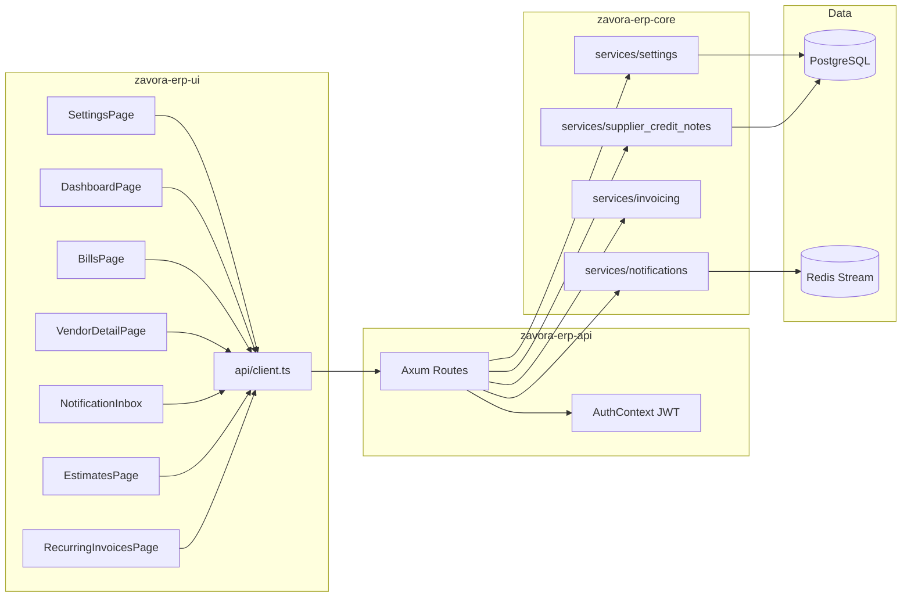

# Design Document: Release Readiness Fixes

## Overview

This design addresses 10 issues identified during a pre-release UI audit. The fixes span the full stack — from missing backend service logic to frontend UX gaps — and integrate with the existing Rust/Axum + React/TypeScript architecture without introducing new infrastructure dependencies.

**Approach:** Each fix is designed as an incremental change to the established codebase patterns. Backend changes follow the existing `(engine, entity_id, req, actor)` service signature convention. Frontend changes reuse `@tanstack/react-query` hooks, the shared component library (`PageHeader`, `DataTable`, `Modal`, `StatCard`), and Tailwind utility classes. No new database tables are required — all fixes use existing tables or add columns to them.

**Priority tiers:**
- **BLOCKING (Issues 1–2):** Settings save and supplier CN full reversal — both cause data loss or 100% workflow failure
- **MEDIUM (Issues 3–10):** Pagination, loading states, recurring invoices, estimate CRUD, vendor detail, notifications, dashboard empty state, statement send

---

## Architecture

### System Context



### Integration Strategy per Fix

| # | Fix | Layer | Integration Point |
|---|-----|-------|-------------------|
| 1 | Settings save | Frontend | Wire `useMutation` → existing `PUT /settings` + `svc::update_settings` |
| 2 | Supplier CN full reversal | Backend | Add bill-line-copy logic to `create_supplier_credit_note` |
| 3 | Pagination | Both | Add `PaginationParams` extractor + paginated queries; frontend pagination controls |
| 4 | Loading/error states | Frontend | Add `isLoading`/`isError` handling to Dashboard + Settings |
| 5 | Recurring invoices | Backend | Implement `create/update/delete` in `services/invoicing` for recurring |
| 6 | Estimate edit/delete | Both | Add `PUT`/`DELETE` routes + service functions + frontend buttons |
| 7 | Vendor detail page | Both | New `GET /vendors/{id}` enriched response + `VendorDetailPage` component |
| 8 | Notification inbox | Both | New `GET /notifications` route + `NotificationInbox` component in Header |
| 9 | Dashboard empty state | Frontend | Conditional render based on `DashboardSummary` entity counts |
| 10 | Customer statement send | Both | New `POST /customers/{id}/send-statement` + frontend dialog |

---

## Components and Interfaces

### Issue 1: Settings Save — API Contract

**Backend (already exists, no changes needed):**
```rust
// PUT /api/v1/settings
// Request: SettingsPatch (partial fields — only non-None fields are applied)
pub async fn update_settings(engine, entity_id, patch: SettingsPatch, actor) -> ErpResult<ErpConfig>
```

**Frontend mutation (new):**
```typescript
// SettingsPage.tsx — add useMutation hook
const mutation = useMutation({
  mutationFn: (data: Partial<ErpConfig>) => updateSettings(data),
  onSuccess: () => {
    queryClient.invalidateQueries({ queryKey: ['settings'] });
    toast.success('Settings saved');
  },
  onError: (err: AxiosError<{ error: string }>) => {
    toast.error(err.response?.data?.error || 'Failed to save settings');
  },
});
```

**Key design decision:** The settings page currently uses `defaultValue` on inputs (uncontrolled). We convert to controlled state with `useState` so we can build the patch object on save and retain edits on error. Each tab manages its own slice of state initialized from the query data.

---

### Issue 2: Supplier CN Full Reversal — Service Signature

**Modified service function:**
```rust
// services/supplier_credit_notes.rs
pub async fn create_supplier_credit_note(
    engine: &ErpEngine,
    entity_id: Uuid,
    req: CreateSupplierCreditNoteRequest,
    created_by: &AgentOrUserId,
) -> ErpResult<SupplierCreditNote>
```

**Logic change:** When `req.lines.is_empty()` AND `req.applies_to_bill` is `Some(bill_id)`:
1. Fetch bill lines from `bill_lines WHERE bill_id = $1`
2. If bill lines are empty, return `ErpError::ValidationFailed { message: "Bill has no lines to reverse" }`
3. Map each `BillLine` → `CreateInvoiceLineRequest` (copying description, quantity, unit_price, account_code, vat_treatment)
4. Continue with existing line resolution + totaling logic

This mirrors the customer credit note pattern in `create_credit_note()` where `req.lines.is_empty()` triggers full reversal from `invoice_lines`.

---

### Issue 3: Pagination — Shared Extractor

**Backend — Shared pagination extractor:**
```rust
// routes/pagination.rs (new module)
use axum::extract::Query;
use serde::{Deserialize, Serialize};

#[derive(Debug, Deserialize)]
pub struct PaginationParams {
    pub limit: Option<i64>,
    pub offset: Option<i64>,
}

impl PaginationParams {
    pub fn effective_limit(&self) -> i64 {
        self.limit.unwrap_or(50).min(500).max(1)
    }
    pub fn effective_offset(&self) -> i64 {
        self.offset.unwrap_or(0).max(0)
    }
}

#[derive(Debug, Serialize)]
pub struct PaginatedResponse<T: Serialize> {
    pub data: Vec<T>,
    pub total_count: i64,
    pub limit: i64,
    pub offset: i64,
    pub has_more: bool,
}
```

**Usage pattern per route (e.g., invoices):**
```rust
pub async fn list(
    ctx: AuthContext,
    State(state): State<Arc<AppState>>,
    Query(params): Query<PaginationParams>,
) -> Result<Json<PaginatedResponse<InvoiceRow>>, ...> {
    let limit = params.effective_limit();
    let offset = params.effective_offset();
    let total_count = sqlx::query_scalar::<_, i64>(
        "SELECT COUNT(*) FROM invoices WHERE entity_id = $1"
    ).bind(ctx.entity_id).fetch_one(pool).await?;
    let data = sqlx::query_as::<_, InvoiceRow>(
        "SELECT * FROM invoices WHERE entity_id = $1 ORDER BY created_at DESC LIMIT $2 OFFSET $3"
    ).bind(ctx.entity_id).bind(limit).bind(offset).fetch_all(pool).await?;
    Ok(Json(PaginatedResponse {
        has_more: offset + limit < total_count,
        data, total_count, limit, offset,
    }))
}
```

**Frontend — Pagination hook:**
```typescript
// hooks/usePagination.ts (new)
export function usePagination(defaultLimit = 50) {
  const [searchParams, setSearchParams] = useSearchParams();
  const page = parseInt(searchParams.get('page') || '1', 10);
  const limit = parseInt(searchParams.get('limit') || String(defaultLimit), 10);
  const offset = (page - 1) * limit;

  const goToPage = (p: number) => {
    setSearchParams(prev => { prev.set('page', String(p)); return prev; });
  };

  return { page, limit, offset, goToPage };
}
```

**Endpoints to paginate:** invoices, bills, customers, vendors, payments, estimates, journal-entries, products, accounts.

---

### Issue 4: Loading and Error States — Component Patterns

**Skeleton component (new shared component):**
```typescript
// components/shared/Skeleton.tsx
export function SkeletonCard() {
  return <div className="card p-6 animate-pulse"><div className="h-4 bg-gray-200 rounded w-1/3 mb-3" /><div className="h-8 bg-gray-200 rounded w-1/2" /></div>;
}
export function SkeletonTable({ rows = 5 }: { rows?: number }) {
  return <div className="card animate-pulse">{Array.from({ length: rows }).map((_, i) => <div key={i} className="px-6 py-4 border-b"><div className="h-4 bg-gray-200 rounded w-full" /></div>)}</div>;
}
```

**ErrorRetry component (new shared component):**
```typescript
// components/shared/ErrorRetry.tsx
export function ErrorRetry({ message, onRetry }: { message: string; onRetry: () => void }) {
  return (
    <div className="text-center py-8">
      <AlertCircle className="w-8 h-8 text-red-400 mx-auto mb-2" />
      <p className="text-sm text-gray-600 mb-3">{message}</p>
      <button onClick={onRetry} className="btn-secondary">Retry</button>
    </div>
  );
}
```

**WidgetErrorBoundary (new):**
```typescript
// components/shared/WidgetErrorBoundary.tsx
class WidgetErrorBoundary extends React.Component<Props, { hasError: boolean }> {
  state = { hasError: false };
  static getDerivedStateFromError() { return { hasError: true }; }
  render() {
    if (this.state.hasError) return <ErrorRetry message="Widget failed to load" onRetry={() => this.setState({ hasError: false })} />;
    return this.props.children;
  }
}
```

**Dashboard integration:**
```typescript
// DashboardPage.tsx — wrap each section
const { data, isLoading, isError, refetch } = useQuery<DashboardSummary>({...});
if (isLoading) return <DashboardSkeleton />;
if (isError) return <ErrorRetry message="Failed to load dashboard" onRetry={refetch} />;
// Each widget wrapped in <WidgetErrorBoundary>
```

---

### Issue 5: Recurring Invoices — Backend Service

**New service functions:**
```rust
// services/recurring_invoices.rs (new file, or extend services/invoicing.rs)

pub async fn create_recurring_invoice(
    engine: &ErpEngine, entity_id: Uuid,
    req: CreateRecurringInvoiceRequest, actor: &AgentOrUserId,
) -> ErpResult<RecurringInvoice>

pub async fn update_recurring_invoice(
    engine: &ErpEngine, entity_id: Uuid, id: Uuid,
    req: UpdateRecurringInvoiceRequest, actor: &AgentOrUserId,
) -> ErpResult<RecurringInvoice>

pub async fn delete_recurring_invoice(
    engine: &ErpEngine, entity_id: Uuid, id: Uuid,
) -> ErpResult<()>
```

**Request types:**
```rust
#[derive(Debug, Deserialize)]
pub struct CreateRecurringInvoiceRequest {
    pub customer_id: Uuid,
    pub frequency: RecurringFrequency,  // Weekly, Monthly, Quarterly, Annually
    pub start_date: NaiveDate,
    pub end_date: Option<NaiveDate>,
    pub lines: Vec<CreateInvoiceLineRequest>,  // reuse existing line type
}

#[derive(Debug, Deserialize)]
pub struct UpdateRecurringInvoiceRequest {
    pub customer_id: Option<Uuid>,
    pub frequency: Option<RecurringFrequency>,
    pub start_date: Option<NaiveDate>,
    pub end_date: Option<Option<NaiveDate>>,  // None = don't change, Some(None) = clear
    pub lines: Option<Vec<CreateInvoiceLineRequest>>,
    pub is_active: Option<bool>,
}
```

**Validation rules (HTTP 422):**
- `customer_id` must belong to `entity_id`
- `frequency` must be a valid enum variant
- `end_date` (if provided) must be >= `start_date`
- `lines` must contain at least one item

**Route registration:**
```rust
.route("/api/v1/recurring-invoices", get(list_recurring).post(create_recurring))
.route("/api/v1/recurring-invoices/{id}", put(update_recurring).delete(delete_recurring))
```

---

### Issue 6: Estimate Edit/Delete — Service & Route

**New service functions (in `services/invoicing.rs`):**
```rust
pub async fn update_estimate_draft(
    engine: &ErpEngine, entity_id: Uuid, id: Uuid,
    req: CreateEstimateRequest,  // reuse create request for full replacement
) -> ErpResult<()>

pub async fn delete_estimate_draft(
    engine: &ErpEngine, entity_id: Uuid, id: Uuid,
) -> ErpResult<()>
```

**Status guard:** Both functions first check `status = 'draft'`. If not draft, return:
```rust
ErpError::Conflict { message: "Only draft estimates can be edited/deleted" }
```

Mapped to HTTP 409 by `err_response`.

**Route pattern (mirrors bills):**
```rust
.route("/api/v1/estimates/{id}", put(routes::estimates::update).delete(routes::estimates::delete))
```

**Frontend additions:**
```typescript
// api/client.ts
export const updateEstimate = (id: string, data: any) => api.put(`/estimates/${id}`, data);
export const deleteEstimate = (id: string) => api.delete(`/estimates/${id}`);
```

---

### Issue 7: Vendor Detail Page — API & Component

**Enriched vendor endpoint:**
```rust
// GET /api/v1/vendors/{id} — returns vendor + summary stats
pub async fn get_one(ctx, state, Path(id)) -> Result<Json<VendorDetail>> {
    // Fetch vendor record
    // Compute: total_billed, total_paid, outstanding_balance
    // Return: { vendor, stats: { total_billed, total_paid, outstanding } }
}
```

**Response shape:**
```typescript
interface VendorDetail {
  vendor: Vendor;
  stats: {
    total_billed: number;
    total_paid: number;
    outstanding_balance: number;  // sum(unpaid bills) - sum(unapplied credit notes)
    bill_count: number;
    payment_count: number;
    credit_note_count: number;
  };
}
```

**Frontend component:** `VendorDetailPage.tsx` mirrors `CustomerDetailPage.tsx` layout:
- Info header card (name, contact, KRA PIN, payment terms)
- Balance summary card
- Tabbed data tables: Bills | Payments | Credit Notes
- Action buttons: New Bill, Record Payment

---

### Issue 8: Notification Inbox — API & Component

**New API routes:**
```rust
// GET /api/v1/notifications?unread_only=false&limit=20
pub async fn list_notifications(ctx, state, Query(params)) -> Result<Json<...>>

// PATCH /api/v1/notifications/{id}/read
pub async fn mark_read(ctx, state, Path(id)) -> Result<Json<...>>

// POST /api/v1/notifications/mark-all-read
pub async fn mark_all_read(ctx, state) -> Result<Json<...>>

// GET /api/v1/notifications/unread-count
pub async fn unread_count(ctx, state) -> Result<Json<{ count: i64 }>>
```

**Frontend component:** `NotificationInbox.tsx` in `components/layout/`:
```typescript
interface NotificationInboxProps {}
// Uses useQuery(['notifications-unread-count']) with refetchInterval: 30000 (polling)
// Bell icon with badge count
// Dropdown drawer on click with notification list
// Each item: title, body preview (truncated), relative timestamp, read indicator
// Click → markRead mutation + navigate to related resource
// "Mark all as read" button at top of drawer
```

**Integration:** Imported and rendered in `Header.tsx` replacing the existing static bell button.

---

### Issue 9: Dashboard Empty State

**Condition:** `summary.total_receivable === 0 && summary.total_payable === 0 && summary.cash_and_bank === 0` plus no invoices/bills/payments (we add `invoice_count`, `bill_count`, `payment_count` to the summary response).

**Dashboard summary API change:** Add `invoice_count`, `bill_count`, `payment_count` fields to `DashboardSummary` response.

**Frontend component:** `DashboardOnboarding.tsx`:
```typescript
const isNewTenant = summary.invoice_count === 0 
  && summary.bill_count === 0 
  && summary.payment_count === 0;

if (isNewTenant) return <DashboardOnboarding />;
// else render standard dashboard
```

**Onboarding checklist items:**
1. "Set up your company" → `/settings`
2. "Create your first customer" → `/customers`
3. "Send your first invoice" → `/invoices`
4. "Record a payment" → `/payments`
5. "Add a vendor" → `/vendors`

---

### Issue 10: Customer Statement Send

**New API endpoint:**
```rust
// POST /api/v1/customers/{id}/send-statement
#[derive(Deserialize)]
pub struct SendStatementRequest {
    pub channel: Channel,        // Email, WhatsApp, SMS
    pub period_from: NaiveDate,
    pub period_to: NaiveDate,
}

pub async fn send_statement(ctx, state, Path(id), Json(req)) -> Result<Json<...>> {
    // Validate customer has contact for channel
    // Generate statement (reuse existing getCustomerStatement logic)
    // Enqueue notification via send_notification service
    // Return { status: "queued" }
}
```

**Frontend:** Add `SendStatementDialog` modal to the customer statement page with:
- Channel selector (email/WhatsApp/SMS) — disabled options when no contact available
- Customer contact preview
- Confirm/Cancel buttons
- Calls `api.post(`/customers/${id}/send-statement`, { channel, period_from, period_to })`

---

## Data Models

### No New Tables Required

All fixes use existing tables. The following schema additions are needed:

**`DashboardSummary` response (Issue 9) — add fields:**
```sql
-- No DB change; these are computed in the dashboard_summary query:
-- COUNT(*) FROM invoices WHERE entity_id = $1
-- COUNT(*) FROM bills WHERE entity_id = $1
-- COUNT(*) FROM payments WHERE entity_id = $1
```

### API Response Shapes

**PaginatedResponse (Issue 3):**
```typescript
interface PaginatedResponse<T> {
  data: T[];
  total_count: number;
  limit: number;
  offset: number;
  has_more: boolean;
}
```

**NotificationListItem (Issue 8):**
```typescript
interface NotificationListItem {
  id: string;
  event_type: string;
  subject: string | null;
  body: string;
  related_type: string | null;
  related_id: string | null;
  status: 'queued' | 'sent' | 'delivered' | 'failed' | 'read';
  read_at: string | null;
  created_at: string;
}
```

**VendorDetail (Issue 7):**
```typescript
interface VendorDetail {
  vendor: {
    id: string;
    name: string;
    email: string | null;
    phone: string | null;
    kra_pin: string | null;
    payment_terms: string;
    currency: string;
    is_active: boolean;
  };
  stats: {
    total_billed: number;
    total_paid: number;
    outstanding_balance: number;
    bill_count: number;
    payment_count: number;
    credit_note_count: number;
  };
}
```

**RecurringInvoice (Issue 5):**
```typescript
interface RecurringInvoice {
  id: string;
  entity_id: string;
  customer_id: string;
  frequency: 'weekly' | 'monthly' | 'quarterly' | 'annually';
  start_date: string;
  end_date: string | null;
  next_run: string;
  lines: CreateInvoiceLineRequest[];
  is_active: boolean;
  created_at: string;
}
```

---

## Correctness Properties

*A property is a characteristic or behavior that should hold true across all valid executions of a system — essentially, a formal statement about what the system should do. Properties serve as the bridge between human-readable specifications and machine-verifiable correctness guarantees.*

### Property 1: Full Reversal Copies All Bill Lines

*For any* bill with one or more line items, when a supplier credit note is created with empty lines (indicating full reversal) against that bill, the resulting credit note SHALL contain exactly the same number of lines as the original bill, with each line's description, quantity, unit_price, and account_code matching the corresponding original bill line.

**Validates: Requirements 2.1, 2.2**

### Property 2: Explicit Lines Override Full Reversal

*For any* set of explicitly provided credit note line items, when a supplier credit note is created with those lines, the resulting credit note SHALL contain exactly the provided lines regardless of the original bill's contents — no lines from the bill are copied.

**Validates: Requirements 2.3**

### Property 3: Pagination Envelope Invariants

*For any* list API request with any combination of `limit` and `offset` parameters:
- The effective limit SHALL be clamped to [1, 500] with a default of 50
- The response `data` array length SHALL be ≤ effective limit
- The response `has_more` SHALL equal `(offset + limit) < total_count`
- `total_count` SHALL be ≥ `data.length`

**Validates: Requirements 3.2, 3.3, 3.4**

### Property 4: Recurring Invoice Persistence Round-Trip

*For any* valid `CreateRecurringInvoiceRequest` (valid customer, valid frequency, end_date ≥ start_date, non-empty lines), creating the recurring invoice and then retrieving it SHALL produce a record with matching customer_id, frequency, start_date, end_date, next_run (= start_date), and line items.

**Validates: Requirements 5.1, 5.2**

### Property 5: Recurring Invoice Validation Rejects Invalid Inputs

*For any* `CreateRecurringInvoiceRequest` where customer_id is non-existent, or frequency is invalid, or end_date < start_date, or lines is empty, the service SHALL return an HTTP 422 error with a descriptive message and SHALL NOT persist any record.

**Validates: Requirements 5.6**

### Property 6: Non-Draft Estimate Status Guard

*For any* estimate in a non-draft status (sent, accepted, declined, expired, converted), both edit (`PUT`) and delete (`DELETE`) operations SHALL be rejected with HTTP 409, and the estimate SHALL remain unchanged in the database.

**Validates: Requirements 6.3, 6.4**

### Property 7: Vendor Outstanding Balance Computation

*For any* vendor with a set of bills and supplier credit notes, the outstanding balance returned by `GET /vendors/{id}` SHALL equal the sum of all unpaid bill gross_totals minus the sum of all posted supplier credit note gross_totals for that vendor.

**Validates: Requirements 7.3**

### Property 8: Dashboard Empty State Threshold

*For any* dashboard summary where invoice_count = 0 AND bill_count = 0 AND payment_count = 0, the frontend SHALL render the onboarding empty state. For any summary where at least one of these counts is > 0, the frontend SHALL render the standard dashboard with charts and metrics.

**Validates: Requirements 9.1, 9.4**

---

## Error Handling

### Backend Error Responses

All error responses follow the existing `err_response` pattern returning `{ "error": "message" }` with appropriate HTTP status codes:

| Scenario | HTTP Code | Error Type |
|----------|-----------|------------|
| Validation failure (bad input, missing fields) | 422 | `ErpError::ValidationFailed` |
| Status conflict (edit non-draft estimate) | 409 | `ErpError::Conflict` |
| Resource not found | 404 | `ErpError::NotFound` |
| Permission denied | 403 | `ErpError::PermissionDenied` |
| Database error | 500 | `ErpError::Database` |

### Frontend Error Handling

| Component | Strategy |
|-----------|----------|
| Settings save | Error toast with API message; form state preserved; button re-enabled |
| Dashboard widgets | Per-widget error boundary; individual retry buttons |
| List pages (pagination) | Full-page error state with retry; preserve current page in URL |
| Mutations (create/edit/delete) | Toast error notification; modal stays open on failure |
| Notification inbox | Silent retry with exponential backoff; degrade to stale count |

### Specific Error Cases

1. **Supplier CN full reversal on lineless bill:** Returns 422 "Bill has no lines to reverse" — frontend shows this in error toast
2. **Pagination with invalid offset:** Offset > total_count returns empty data array with correct total_count (not an error)
3. **Mark notification read (already read):** Idempotent — returns success without changing state
4. **Send statement without contact:** Frontend disables channel selector; if somehow bypassed, backend returns 422 "Customer has no {channel} contact configured"
5. **Delete non-draft estimate:** Returns 409 "Only draft estimates can be deleted" — frontend shows confirmation was premature

---

## Testing Strategy

### Unit Tests (Example-Based)

| Issue | Test Cases |
|-------|-----------|
| 1 - Settings | Save success shows toast; save error shows error toast and preserves form; button disabled during save |
| 2 - Supplier CN | Full reversal success notification; error on lineless bill |
| 4 - Loading | Dashboard skeleton renders; Settings skeleton renders; error boundary isolates widget failure |
| 6 - Estimates | Edit/Delete buttons visible for draft; hidden for non-draft |
| 7 - Vendor Detail | Page renders vendor info header; tabs display correct sections |
| 8 - Notifications | Bell badge shows count; drawer opens on click; mark-all-read updates UI |
| 9 - Empty State | Onboarding renders with zero data; standard dashboard renders with non-zero data |
| 10 - Send Statement | Dialog shows correct channels; disabled when no contact |

### Property-Based Tests

Property-based testing applies to the backend logic where input varies meaningfully:

**Library:** `proptest` (Rust) for backend properties; `fast-check` (TypeScript) for frontend computation properties.

**Configuration:** Minimum 100 iterations per property test.

| Property | Target | Tag |
|----------|--------|-----|
| Property 1: Full reversal line copy | `services/supplier_credit_notes.rs` | `Feature: release-readiness-fixes, Property 1: Full reversal copies all bill lines` |
| Property 2: Explicit lines override | `services/supplier_credit_notes.rs` | `Feature: release-readiness-fixes, Property 2: Explicit lines override full reversal` |
| Property 3: Pagination invariants | `routes/pagination.rs` (unit test the extractor + envelope logic) | `Feature: release-readiness-fixes, Property 3: Pagination envelope invariants` |
| Property 4: Recurring invoice round-trip | `services/recurring_invoices.rs` | `Feature: release-readiness-fixes, Property 4: Recurring invoice persistence round-trip` |
| Property 5: Recurring invoice validation | `services/recurring_invoices.rs` | `Feature: release-readiness-fixes, Property 5: Recurring invoice validation rejects invalid inputs` |
| Property 6: Estimate status guard | `services/invoicing.rs` | `Feature: release-readiness-fixes, Property 6: Non-draft estimate status guard` |
| Property 7: Vendor balance computation | `routes/vendors.rs` or extracted helper | `Feature: release-readiness-fixes, Property 7: Vendor outstanding balance computation` |
| Property 8: Empty state threshold | Frontend utility function | `Feature: release-readiness-fixes, Property 8: Dashboard empty state threshold` |

### Integration Tests

| Issue | Test |
|-------|------|
| 3 - Pagination | Hit each list endpoint with various limit/offset, verify envelope |
| 5 - Recurring invoices | Full CRUD cycle via HTTP |
| 7 - Vendor detail | Create vendor + bills + payments, GET detail, verify stats |
| 8 - Notifications | Create notifications, GET list, mark read, verify state changes |
| 10 - Send statement | POST send-statement, verify Redis stream entry created |

### Test Approach Notes

- Backend property tests use an in-memory SQLite or test-scoped PostgreSQL transaction that rolls back
- Frontend property tests for Property 8 test a pure function `isNewTenant(summary)` with `fast-check`
- Property 3 can be unit-tested purely on the `PaginationParams` struct methods without DB
- Properties 1, 2, 4, 5, 6, 7 require a test database but can run in isolated transactions
