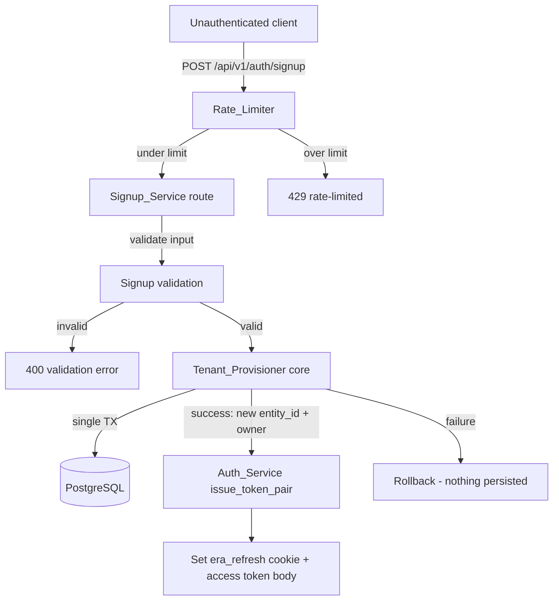
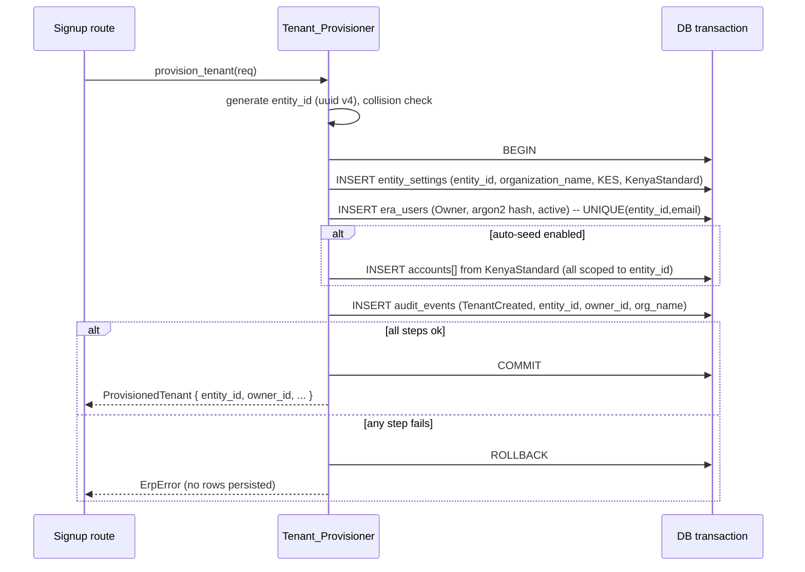
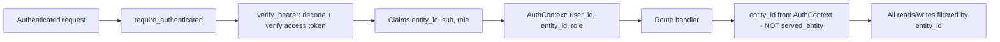

# Design Document

## Overview

This design adds true multi-tenant **signup** to Zavora ERP and cleanly separates it from the existing **invite** flow, while shifting authenticated request scoping from a single process-global entity to the tenant carried in each verified JWT.

Today the platform is single-tenant-per-process. Two facts encode this:

- `middleware::auth::SERVED_ENTITY` is a process-global `OnceLock<Uuid>` set from `ENTITY_ID` at startup, and `verify_bearer` rejects any access token whose `entity_id` claim differs from it.
- `ErpEngine::entity_id()` returns `config.entity_id` (the same startup value), and every service scopes its SQL by `engine.entity_id()`.

The database is already multi-tenant-ready: every business table is keyed by `entity_id` and `era_users` enforces `UNIQUE(entity_id, email)`. So the change is at runtime, not in the table layout: we must be able to create new tenants on demand and scope each request to the tenant in its token.

The work splits into four cohesive pieces:

1. **Tenant_Provisioner** (core) — a new `tenant` module that atomically creates an `entity_id`, its `entity_settings` row (with `organization_name`, base currency `KES`, COA template `KenyaStandard`), its first **Owner** user (Argon2id hash), optionally seeds the chart of accounts, and records a tenant-creation audit event — all inside one database transaction.
2. **Signup_Service** (api) — a new public `POST /api/v1/auth/signup` route that validates input, invokes the provisioner, issues a JWT token pair, persists the refresh token, sets the httpOnly refresh cookie, and returns the access token plus tenant/owner identity.
3. **Tenant_Scope_Resolver** (api) — the auth middleware stops rejecting tokens minted for non-served entities and instead trusts the verified token's `entity_id`; data access is scoped to that per-request `entity_id` rather than to `ENTITY_ID`. Legacy deployments keep working because tokens they issue carry the served entity.
4. **Rate_Limiter** (api) — a Redis-backed fixed-window throttle on the public signup endpoint, plus non-enumerating error responses.

The legacy `POST /api/v1/auth/register` endpoint is retained for backward compatibility and marked deprecated.

### Research notes

- **JWT/identity** (`zavora-erp-core/src/auth/mod.rs`): HS256 access/refresh tokens. `Claims { sub, entity_id, role, token_type, jti, iat, exp }`. `issue_token_pair(cfg, user_id, entity_id, role)` already mints a token whose `entity_id` claim is whatever we pass — so issuing a token for a freshly created tenant needs no auth changes. Passwords use Argon2id via `hash_password` / `verify_password`.
- **Cookie/session conventions** (`routes/users.rs`): `auth_success` sets the `era_refresh` cookie (`HttpOnly; SameSite=Strict; Path=/api/v1/auth`) and returns `{ access_token, token_type, expires_in, user }`. The refresh token is never in the body. Signup will reuse these helpers verbatim so behaviour is identical to login.
- **Refresh persistence**: `refresh_tokens(jti, user_id, entity_id, expires_at, revoked, created_at)` (migration 006). Signup persists the issued refresh `jti` the same way `login`/`register` do.
- **Settings/COA** (`settings/mod.rs`, `services/accounts.rs`): `entity_settings` defaults `base_currency='KES'`, `coa_template='KenyaStandard'`. `seed_coa(engine, template, by)` builds accounts from `kenya_standard_coa()` but writes via `engine.pool()` (auto-commit) and scopes by `engine.entity_id()` — neither is transaction-aware nor parameterised by a target entity. The provisioner therefore needs transaction-aware, entity-parameterised insert helpers.
- **No `organization_name` column** exists today (only `branding.company_name`). A migration adds `entity_settings.organization_name`.
- **Audit** (`audit/mod.rs`, `services/*`): there is an `audit_events` table and a best-effort Redis stream `erp:audit:{entity_id}`. For tenant creation we write an `audit_events` row **inside the provisioning transaction** so the audit record shares the all-or-nothing guarantee.

## Architecture

### System context



### Provisioning transaction (all-or-nothing)



### Per-request tenant scoping



The single behavioural change in the middleware is removing the `claims.entity_id != served_entity()` rejection. Identity is still proven cryptographically; the verified `entity_id` claim becomes the authoritative scope. `served_entity()` is retained solely for the legacy `register` bootstrap path.

### Crate placement

- `zavora-erp-core/src/tenant/mod.rs` — **new**. `Tenant_Provisioner`, request/result types, validation, transaction-aware COA seeding helper, audit write.
- `zavora-erp-api/src/routes/auth_signup.rs` (or extend `routes/users.rs`) — **new** `signup` handler + `Rate_Limiter`.
- `zavora-erp-api/src/middleware/auth.rs` — **modified** `verify_bearer` (drop served-entity gate).
- `zavora-erp-api/src/main.rs` — **modified** router: register `/api/v1/auth/signup` on the public router.
- `migrations/007_tenant_signup.sql` — **new** `organization_name` column.

## Components and Interfaces

### 1. Tenant_Provisioner (`zavora-erp-core/src/tenant/mod.rs`)

The atomic creation unit. It does not depend on `ErpEngine::entity_id()`; it generates and threads a fresh `entity_id` explicitly.

```rust
/// Validated, normalised signup inputs (produced by `validate_signup`).
pub struct ProvisionTenantRequest {
    pub organization_name: String, // trimmed, non-empty
    pub owner_email: String,       // syntactically valid
    pub owner_display_name: String,// trimmed, non-empty
    pub owner_password: String,    // >= 8 chars (plaintext, hashed inside)
    pub seed_chart_of_accounts: bool, // whether to auto-seed COA
}

/// Result returned to the API layer after a successful commit.
pub struct ProvisionedTenant {
    pub entity_id: Uuid,
    pub owner_user_id: Uuid,
    pub owner_email: String,
    pub owner_display_name: String,
    pub role: String,            // always "Owner"
    pub organization_name: String,
    pub accounts_seeded: u32,
}

/// Provision a brand-new tenant atomically. All inserts share one transaction;
/// any failure rolls the whole thing back (Req 2.4, 2.5, 3.5, 14.1, 14.2).
pub async fn provision_tenant(
    pool: &sqlx::PgPool,
    req: ProvisionTenantRequest,
) -> ErpResult<ProvisionedTenant>;
```

Behaviour:

1. Generate `entity_id = Uuid::new_v4()` (collision against any existing tenant is astronomically unlikely; we additionally guard by the natural keys below). (Req 2.1, 12.2, 12.3)
2. `let mut tx = pool.begin().await?;`
3. Hash password with `auth::hash_password` (Argon2id) — never store plaintext. (Req 2.3, 2.6)
4. `INSERT INTO entity_settings (entity_id, organization_name, base_currency, coa_template)` with `base_currency='KES'`, `coa_template='KenyaStandard'`; remaining columns take their schema defaults. (Req 2.2, 3.1, 12.1)
5. `INSERT INTO era_users (id, entity_id, email, display_name, role, password_hash, status, is_active)` with role `Owner`, `status='active'`, `is_active=true`. The `UNIQUE(entity_id, email)` constraint makes a duplicate Owner email within this new tenant a unique-violation, mapped to a duplicate-email error. (Req 2.3, 8.1, 8.3, 13.3)
6. If `seed_chart_of_accounts`: insert every `kenya_standard_coa()` account scoped to the new `entity_id` via `seed_coa_in_tx(&mut tx, entity_id, &CoaTemplate::KenyaStandard)`. A failure here aborts the whole transaction. (Req 3.2, 3.4, 3.5)
7. `INSERT INTO audit_events (entity_id, event_type, object_type, object_id, actor, after_state, metadata)` recording the creation — `event_type='Created'`, `object_type='tenant'`, `object_id=entity_id`, and metadata `{ organization_name, owner_user_id, created_at }`. No password or hash is written. (Req 11.1, 11.2, 11.3)
8. `tx.commit().await?;` returns `ProvisionedTenant`.

A transaction-aware seeding helper is required because the existing `seed_coa` writes through the auto-committing pool and is scoped to `engine.entity_id()`:

```rust
/// Insert all template accounts for `entity_id` within an open transaction.
async fn seed_coa_in_tx(
    tx: &mut sqlx::Transaction<'_, sqlx::Postgres>,
    entity_id: Uuid,
    template: &CoaTemplate,
) -> ErpResult<u32>;
```

### 2. Signup input validation (`zavora-erp-core/src/tenant/mod.rs`)

A pure function so it is cheaply property-testable and runs **before** any persistence (Req 7.4).

```rust
pub struct SignupInput {
    pub organization_name: String,
    pub owner_email: String,
    pub owner_display_name: String,
    pub owner_password: String,
}

/// Validate and normalise raw signup input. Returns the first failing field's
/// error; never persists anything.
pub fn validate_signup(input: SignupInput) -> ErpResult<ProvisionTenantRequest>;
```

Rules (each yields `ErpError::ValidationFailed { message }` naming the offending field):

- `organization_name`: reject if empty or whitespace-only (trimmed length 0). (Req 1.6, 7.5)
- `owner_email`: reject if missing/empty, or not syntactically valid (single `@`, non-empty local part, dotted domain). (Req 1.6, 7.1)
- `owner_display_name`: reject if empty or whitespace-only. (Req 1.6)
- `owner_password`: reject if shorter than 8 characters. (Req 1.6, 7.2, 7.3)

Normalisation: trim `organization_name`, `owner_display_name`; trim and lower-case `owner_email` (consistent with `fetch_auth_user`'s `lower(email)` comparisons). Password is not altered.

### 3. Signup_Service route (`zavora-erp-api`)

Public, unauthenticated handler (Req 1.1). Mirrors `register`/`login` response conventions.

```rust
#[derive(serde::Deserialize)]
pub struct SignupRequest {
    pub organization_name: String,
    pub email: String,
    pub display_name: String,
    pub password: String,
}

/// POST /api/v1/auth/signup — create a new tenant + first Owner, return a session.
pub async fn signup(
    State(state): State<Arc<AppState>>,
    headers: axum::http::HeaderMap,
    Json(req): Json<SignupRequest>,
) -> Result<Response, Response>;
```

Flow:

1. `Rate_Limiter::check(client_ip)` — reject with `429` when over threshold. (Req 10.1)
2. `validate_signup(...)` — `400` with field name on failure. (Req 1.6, 7.x)
3. `tenant::provision_tenant(pool, req)` — on duplicate-Owner-email return a generic error that does not reveal cross-tenant existence. (Req 1.2, 8.3, 10.2)
4. `auth::issue_token_pair(jwt_config(), owner_id, new_entity_id, "Owner")`; persist the refresh token (`store_refresh_token`). (Req 1.3, 5.3)
5. Respond via the existing `auth_success` shape: access token + identity in the body, refresh token only in the `era_refresh` httpOnly `SameSite=Strict` cookie. Body additionally includes `entity_id`, `user_id`, `email`, `display_name`, `role: "Owner"`. (Req 1.3, 1.4, 1.5)

Client source for rate limiting is derived from a trusted forwarded header if configured, else the socket peer address; the exact source key is a deployment configuration detail.

### 4. Rate_Limiter (`zavora-erp-api`)

Redis fixed-window counter reusing `engine.redis_conn()`.

```rust
/// Returns Ok(()) if under the limit, Err(ErpError) ("rate limited") otherwise.
pub async fn check_signup_rate(
    redis: &mut redis::aio::MultiplexedConnection,
    client_key: &str,
) -> ErpResult<()>;
```

- Key: `signup:rl:{client_key}:{window}`; `INCR` then `EXPIRE` to the window length on first hit; reject when the count exceeds the configured threshold. (Req 10.1)
- Threshold and window come from env (`SIGNUP_RATE_MAX`, `SIGNUP_RATE_WINDOW_SECS`) with safe defaults.
- Redis being unavailable fails open for availability (signup still works) but logs a warning — abuse protection is best-effort, correctness of tenant creation is not affected.

### 5. Tenant_Scope_Resolver (`zavora-erp-api/src/middleware/auth.rs`)

`verify_bearer` keeps decoding/verifying the access token and building `AuthContext { user_id, entity_id, role }` but **removes** the served-entity equality check:

```rust
// REMOVED (was Req 3.3 single-tenant gate):
// if claims.entity_id != served_entity() {
//     return Err(unauthorized("Token entity is not served by this instance"));
// }
```

`AuthContext.entity_id` (the verified claim) is the per-request tenant scope (Req 4.1, 4.2, 4.3, 4.4, 5.1). Handlers and services scope all SQL by this value instead of `engine.entity_id()`. Cross-tenant access is structurally impossible: a query filtered by tenant A's `entity_id` can never match tenant B's rows, so a request for another tenant's resource returns not-found. (Req 5.1, 5.2)

`decode_access_token` already rejects bad signatures, wrong token type, and expired tokens, satisfying Req 5.4 unchanged.

> **Scoping migration note.** Services presently call `engine.entity_id()`. The target is to thread the request `entity_id` explicitly. The recommended, low-risk shape is a request-scoped handle:
>
> ```rust
> impl ErpEngine { pub fn scoped(&self, entity_id: Uuid) -> TenantScope<'_> { ... } }
> pub struct TenantScope<'a> { engine: &'a ErpEngine, entity_id: Uuid }
> impl TenantScope<'_> { pub fn entity_id(&self) -> Uuid { self.entity_id } /* pool(), redis() forward */ }
> ```
>
> Handlers build `state.engine.scoped(ctx.entity_id)` and pass it where `&ErpEngine` was used; service signatures change from `&ErpEngine` to `&TenantScope`. In legacy single-tenant mode `ctx.entity_id == served_entity()`, so behaviour is identical (Req 9.4). This refactor is broad but mechanical; this spec's tasks focus on the signup path and the scope-resolver change, with the service migration tracked as its own work item.

### 6. Invite_Service (existing `POST /users`) — unchanged behaviour, clarified boundary

`routes::users::create` already requires a valid token with role Owner/Admin (`ROLES_MANAGE`) and sets the new user's `entity_id` to `ctx.entity_id`. With per-request scoping this naturally becomes the caller's tenant. (Req 6.2, 6.3, 6.4, 6.5, 6.6) No new tenant is ever created here. (Req 6.1)

**First Owner protection** (Req 13.1, 13.2) is a guard added to the user update/deactivate path: before deactivating an Owner or changing an Owner's role away from Owner, count active Owners for the tenant and reject if the count is 1. (A `routes::users::update` handler is the home for this check.)

### 7. Legacy compatibility (`register`)

`POST /api/v1/auth/register` is unchanged in behaviour: it still bootstraps the first Owner for `served_entity()` when that entity has no active users (Req 9.2), and tokens issued for the served entity continue to verify (Req 9.1, 9.4). It is documented as **deprecated** in favour of `/auth/signup` (Req 9.3).

## Data Models

### Migration `007_tenant_signup.sql`

```sql
-- Tenant signup: store the human-readable organisation name per tenant (Req 12.1).
-- Idempotent and backward compatible: existing rows get a default placeholder.
ALTER TABLE entity_settings
    ADD COLUMN IF NOT EXISTS organization_name TEXT NOT NULL DEFAULT 'My Company';
```

No other schema change is needed: `entity_id` keying, `UNIQUE(entity_id, email)` on `era_users`, `refresh_tokens`, and `audit_events` already exist.

### `entity_settings` (relevant columns after migration)

| Column | Type | Notes |
| --- | --- | --- |
| `entity_id` | UUID PK | The tenant key (Req 12.2). |
| `organization_name` | TEXT NOT NULL | Supplied at signup (Req 12.1). |
| `base_currency` | CHAR(3) | `'KES'` at signup (Req 2.2). |
| `coa_template` | TEXT | `'KenyaStandard'` at signup (Req 3.1). |

### `era_users` (Owner created at signup)

| Column | Value at signup |
| --- | --- |
| `id` | new UUID (Owner user id) |
| `entity_id` | new tenant `entity_id` |
| `email` | normalised Owner email; `UNIQUE(entity_id, email)` (Req 8.1) |
| `role` | `'Owner'` (Req 13.3) |
| `password_hash` | Argon2id hash (Req 2.6) |
| `status` / `is_active` | `'active'` / `true` (Req 2.3) |

### `audit_events` (tenant-creation record)

| Column | Value |
| --- | --- |
| `entity_id` | new tenant `entity_id` (Req 11.2) |
| `event_type` | `'Created'` |
| `object_type` | `'tenant'` |
| `object_id` | new tenant `entity_id` |
| `actor` | system/owner reference (JSON) |
| `metadata` | `{ organization_name, owner_user_id, created_at }` — no password/hash (Req 11.3) |

### API response (signup success)

```json
{
  "access_token": "<jwt>",
  "token_type": "Bearer",
  "expires_in": 900,
  "user": {
    "user_id": "<uuid>",
    "entity_id": "<uuid>",
    "role": "Owner",
    "display_name": "Ada Lovelace",
    "email": "ada@example.com"
  }
}
```

Plus `Set-Cookie: era_refresh=<jwt>; HttpOnly; SameSite=Strict; Path=/api/v1/auth; Max-Age=...`. The refresh token is never in the body (Req 1.5).

## Correctness Properties

*A property is a characteristic or behavior that should hold true across all valid executions of a system — essentially, a formal statement about what the system should do. Properties serve as the bridge between human-readable specifications and machine-verifiable correctness guarantees.*

The following properties were derived from the acceptance criteria via the prework analysis and then de-duplicated so each provides unique validation value. Acceptance criteria that are infrastructure facts, one-off wiring, fault-injection rollback checks, or documentation labels are validated by integration/example/smoke tests (see Testing Strategy) rather than properties.

### Property 1: Signup input validation is total and field-accurate

*For any* raw signup input, `validate_signup` accepts it **if and only if** the organization name is non-empty after trimming, the display name is non-empty after trimming, the email is syntactically valid, and the password is at least 8 characters; otherwise it rejects the input with a validation error naming exactly one offending field and reveals no tenant or user identifiers.

**Validates: Requirements 1.6, 7.1, 7.2, 7.3, 7.5, 10.3**

### Property 2: Validation failure persists nothing

*For any* signup input that fails validation, no `entity_settings`, `era_users`, `accounts`, or `audit_events` rows are created (database row counts are unchanged).

**Validates: Requirements 7.4**

### Property 3: Successful provisioning postconditions

*For any* valid signup input, after `provision_tenant` commits there is exactly one `entity_settings` row for the new `entity_id` with `base_currency='KES'`, `coa_template='KenyaStandard'`, and `organization_name` equal to the trimmed supplied name; exactly one `era_users` row for that `entity_id` with role `Owner`, active status, and an Argon2id password hash; and exactly one tenant-creation `audit_events` row scoped to the new `entity_id` capturing the owner user id, organization name, and a timestamp.

**Validates: Requirements 1.2, 2.2, 2.3, 3.1, 11.1, 11.2, 12.1, 13.3**

### Property 4: Seeded chart of accounts is complete and tenant-scoped

*For any* valid signup with automatic seeding enabled, every account in the `KenyaStandard` template exists for the new tenant after commit, and every seeded `accounts` row carries `entity_id` equal to the new tenant's `entity_id` (and no other tenant's).

**Validates: Requirements 3.2, 3.4**

### Property 5: Tenant identifiers are always distinct

*For any* sequence of signups — including signups that supply identical organization names and retries of previously failed attempts — every returned `entity_id` is pairwise distinct and each has its own `entity_settings` row.

**Validates: Requirements 2.1, 12.2, 12.3, 14.3**

### Property 6: Password is hashed, never stored in plaintext

*For any* password, hashing it produces an Argon2id string that `verify_password` accepts for that password, that differs from the plaintext, and against which a different password fails to verify.

**Validates: Requirements 2.6, 2.3**

### Property 7: Access token carries the owning tenant

*For any* user id, tenant `entity_id`, and role, the access token issued by `issue_token_pair` decodes to claims whose `entity_id` equals the supplied tenant `entity_id` and whose role equals the supplied role.

**Validates: Requirements 5.3**

### Property 8: Invalid tokens are rejected

*For any* issued access token, tampering with its bytes, presenting it under the wrong token type (access vs refresh), or letting it expire causes `decode_access_token` to return an error.

**Validates: Requirements 5.4**

### Property 9: Request scope equals the verified token's tenant

*For any* verified access token, the resolved request scope (`AuthContext.entity_id`) equals the token's `entity_id` claim, independent of the process-global served entity and independent of any other concurrent token.

**Validates: Requirements 4.1, 4.2, 4.3, 4.4, 9.1, 9.4**

### Property 10: Cross-tenant isolation

*For any* database populated with rows across multiple tenants, a data access scoped to tenant A returns only rows whose `entity_id` equals A's `entity_id`, and a request for a resource owned by a different tenant resolves to not-found without returning that tenant's data.

**Validates: Requirements 5.1, 5.2**

### Property 11: Signup success response shape

*For any* valid signup, the response body contains an access token and the owner identity (`entity_id`, `user_id`, `role='Owner'`, supplied email and display name), and the refresh token value never appears in the body — it is delivered only as an httpOnly `SameSite=Strict` `era_refresh` cookie.

**Validates: Requirements 1.3, 1.4, 1.5**

### Property 12: Cross-tenant email reuse is allowed

*For any* email already associated with an existing tenant, a signup that creates a different tenant with that same email succeeds.

**Validates: Requirements 8.2**

### Property 13: Audit records never contain secrets

*For any* valid signup, the serialized tenant-creation audit record contains neither the plaintext password nor any Argon2id hash substring.

**Validates: Requirements 11.3**

### Property 14: Invite targets the caller's tenant and never creates one

*For any* authenticated invite, the created user's `entity_id` equals the caller's token `entity_id`, every existing tenant's user roster other than the caller's is unchanged, and no new `entity_settings` row is created.

**Validates: Requirements 6.1, 6.2, 6.4**

### Property 15: Invite authorization by role

*For any* caller role, the invite operation is permitted exactly when the role is `Owner` or `Admin`, and is denied with a permission error otherwise.

**Validates: Requirements 6.3, 6.6**

### Property 16: Sole-Owner protection

*For any* tenant that has exactly one active Owner, a request that would deactivate or remove that Owner, or change that Owner's role to a non-Owner role, is rejected.

**Validates: Requirements 13.1, 13.2**

### Property 17: Rate limiting on public signup

*For any* rate threshold N, window W, and a burst of more than N signup requests from a single client source within W, exactly the first N requests are admitted and every subsequent request within the window is rejected as rate-limited.

**Validates: Requirements 10.1**

### Property 18: Non-enumerating duplicate-email response

*For any* signup rejected because the Owner email collides within the tenant being created, the rejection response is identical whether or not that email exists in any other tenant.

**Validates: Requirements 10.2**

## Error Handling

Errors reuse the existing `ErpError` enum and the `routes::err_response` mapping so HTTP status codes stay consistent across the API.

| Condition | `ErpError` variant | HTTP status |
| --- | --- | --- |
| Missing/empty field, invalid email, short password, whitespace org name | `ValidationFailed { message }` (names the field) | 400 |
| Duplicate Owner email within the new tenant | `Duplicate { message }` — generic, non-enumerating | 409 |
| Rate limit exceeded | `ValidationFailed`/dedicated rate-limit error mapped to 429 | 429 |
| Provisioning transaction failure (any step) | propagated `Database`/`Internal`; transaction rolled back | 500 |
| Unauthenticated invite | `Unauthorized` | 401 |
| Invite by non Owner/Admin | `PermissionDenied` | 403 |

Key handling rules:

- **Validation before persistence**: `validate_signup` runs before `provision_tenant`, so malformed input never opens a transaction (Req 7.4).
- **Atomic rollback**: `provision_tenant` performs all inserts on one `sqlx::Transaction`; returning `Err` before `commit` discards every write, leaving the candidate `entity_id` unreferenced (Req 2.5, 3.5, 14.1, 14.2).
- **Non-enumeration**: the duplicate-email and validation messages carry only field-level information and never disclose whether an email or tenant exists elsewhere (Req 10.2, 10.3). A new `409` mapping for `Duplicate` already exists in `err_response`.
- **Rate-limiter degradation**: if Redis is unreachable the limiter fails open (signup still succeeds) and logs a warning; tenant-creation correctness is never blocked on the limiter.
- **Mapping additions**: a rate-limited outcome needs a 429 mapping; this is added to `err_response` (or returned directly by the signup handler) without altering existing mappings.

## Testing Strategy

### Dual approach

- **Property-based tests** verify the universal properties above across many generated inputs.
- **Unit/example tests** cover specific scenarios and wiring.
- **Integration tests** cover transactional rollback, schema constraints, and end-to-end HTTP behaviour against a real Postgres (the project already runs migrations against Postgres via `sqlx::migrate!`).

### Property-based testing

PBT **is** appropriate for this feature: signup input validation, password hashing, JWT claim/scope resolution, uniqueness, and the provisioning postconditions are all universally quantifiable. Pure-logic properties (1, 6, 7, 8, 9, 15, 17, 18) run entirely in memory; DB-backed properties (2, 3, 4, 5, 10, 11, 12, 13, 14, 16) run against a transactional test database, with each generated case executed in a rolled-back transaction or against a disposable schema for isolation and speed.

- Use the standard Rust property-testing library **`proptest`** (do not hand-roll generators). Add it under `[dev-dependencies]` in both crates as needed.
- Each property test runs a **minimum of 100 cases** (`ProptestConfig { cases: 100, .. }` or higher).
- Each property test is tagged with a comment referencing its design property, in the format:
  `// Feature: tenant-signup, Property {number}: {property text}`
- Generators: organization/display names (including whitespace-only and unicode), emails (valid and malformed), passwords (lengths straddling the 8-char boundary), role enums, and small multi-tenant data sets (lists of `(entity_id, rows)`).
- One property maps to exactly one property test.

### Unit / example tests

- Public signup route reachable without an `Authorization` header (Req 1.1).
- Legacy `register` bootstraps the first Owner and refuses a second registration (Req 9.2).
- Auto-seed disabled yields zero accounts; a later authenticated `/accounts/seed` populates them (Req 3.3).
- Invite with no token returns 401 (Req 6.5).

### Integration tests (against Postgres)

- **Atomic rollback / abandoned signups** (Req 2.4, 2.5, 3.5, 14.1, 14.2): inject a failure after partial inserts (e.g., a colliding Owner email under `UNIQUE(entity_id, email)`, or a forced seeding error) and assert that no `entity_settings`, `era_users`, `accounts`, or `audit_events` row references the candidate `entity_id`.
- **Within-tenant duplicate Owner email** rejected with a duplicate error (Req 8.1, 8.3).
- **Multi-tenant login** verifies credentials within the intended tenant (Req 8.4).
- **End-to-end signup → authenticated request**: sign up, then use the returned access token to read tenant-scoped data and confirm isolation from a second tenant created the same way.

### Smoke / documentation checks

- `register` is annotated as **deprecated** and `/auth/signup` is documented as the supported tenant-creation path (Req 9.3).
