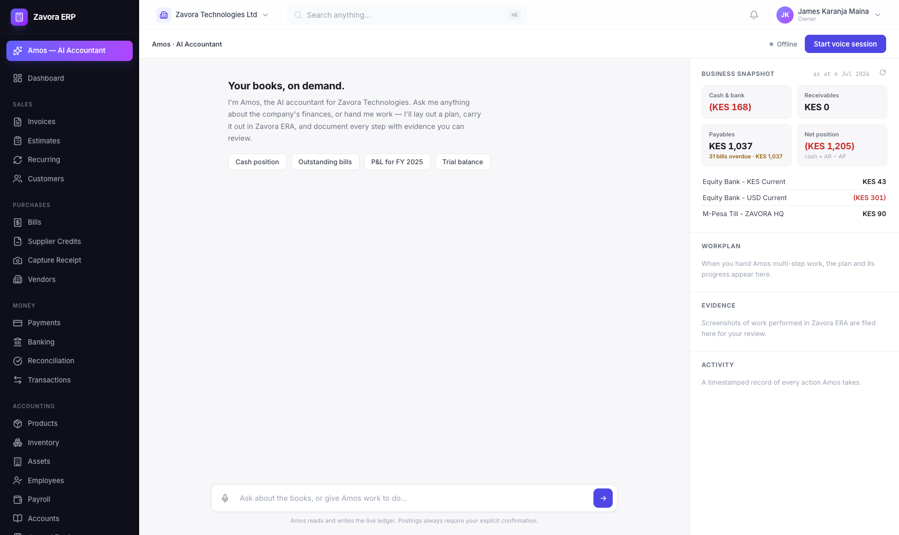

# Amos — Your Personal AI Accountant

Amos is Zavora ERA's agentic layer: a realtime **voice + chat AI accountant** for
non-accountant business owners. You talk (or type); Amos plans the work as a
visible task list, executes it against the live ledger through MCP tools,
drives a real browser through the ERP to **showcase** what it did, and files
screenshot **evidence cards** for your review. Every write to the books is
gated on your explicit confirmation.



## Architecture

```
Browser (ERP /amos page, or standalone :8090)
  │  WebSocket /ws  — binary frames: PCM audio both ways
  │                   JSON frames: chat, tasks, evidence, activity
  ▼
amos (Rust, axum) ── RealtimeRunner ── Gemini Live (native audio)
  │        tools bridged into the realtime session:
  ├── McpServerManager (mcp.json)
  │     ├── mcp-erp  (zavora backend → Zavora ERA REST API :8080)
  │     └── @playwright/mcp --isolated (headed Chrome → ERP UI :3000)
  └── native tools: plan_tasks · update_task · use_skill · erp_login · showcase_step
```

- **Voice**: mic audio (16 kHz mono PCM) streams to Gemini Live; replies come
  back as 24 kHz audio plus live transcripts. Typing works any time, including
  mid-voice-session.
- **Deterministic login**: `browser_navigate` to the ERP signs in automatically
  (the model never touches the login form), and `erp_login` does it explicitly.
- **Auto-continue**: if the model ends a turn with unfinished workplan tasks,
  the server nudges it to keep executing (capped, and it never overrides a
  pending user confirmation).

## Quick start

```bash
# one-time: build the ERP MCP server with the zavora backend
cd ../../mcp-servers/mcp-erp && cargo build --release --features zavora

# configure (see below), then run — amos is its own cargo workspace
cd amos && cargo run
# open http://localhost:8090, or click "Amos — AI Accountant" in the ERP sidebar
```

Requires the ERP API (`:8080`) and UI (`:3000`) running, Node (for
`npx @playwright/mcp`), and a Gemini API key.

### `amos/.env` (gitignored — holds all secrets)

| Variable | Purpose |
|---|---|
| `GOOGLE_API_KEY` | Gemini API key (AI Studio) |
| `GEMINI_LIVE_MODEL` | Live model id (default `models/gemini-live-2.5-flash-native-audio`) |
| `ZAVORA_API_URL` | ERP API base (default `http://localhost:8080`) |
| `ZAVORA_EMAIL` / `ZAVORA_PASSWORD` | Service user for API tool calls (e.g. `amos@zavora.ai`, Accountant role) |
| `ERP_LOGIN_EMAIL` / `ERP_LOGIN_PASSWORD` | Account the visible browser signs in as (defaults to `ZAVORA_*`) |
| `ERP_UI_URL` | ERP web UI (default `http://localhost:3000`) |
| `AMOS_PORT` | Listen port (default `8090`) |
| `AMOS_BROWSER_HEADLESS` | `1` to hide the showcase browser window |

## Configuration surface (edit files, restart — no recompiling)

| File | What it controls |
|---|---|
| **`system.md`** | The system prompt template. Placeholders: `{ui_url}`, `{skills_catalog}`, `{agents_rules}`. Override path with `AMOS_SYSTEM_MD`. |
| **`AGENTS.md`** | Operating rules appended into the prompt: financial guardrails, skill protocol, communication style, escalation. Override with `AMOS_AGENTS_MD`. |
| **`mcp.json`** | MCP servers (Kiro `mcpServers` format). `${VAR}` placeholders expand from the environment, so the file stays secret-free. Override with `AMOS_MCP_JSON`. |
| **`skills/`** | Skill packs (see below). Override directory with `AMOS_SKILLS_DIR`. |

Embedded copies of `system.md`/`AGENTS.md` are compiled in as fallbacks, so the
binary still runs if the files are missing.

## Skills — teachable playbooks

Skills follow the [agentskills.io](https://agentskills.io) / Anthropic Agent
Skills standard: one folder per skill containing a `SKILL.md` with YAML
frontmatter (`name`, `description`, `allowed-tools`, metadata) and a Markdown
body holding a decision tree, exact tool sequences, and MUST DO / MUST NOT
rules. Loading uses **progressive disclosure** to keep the realtime context
lean: the system prompt carries only a one-line catalog per skill; the model
calls the `use_skill` tool to pull a playbook's full body when a job matches.
A skill's `allowed-tools` also extend the MCP tool allowlist, so dropping in a
new skill can unlock the tools it needs.

Installed pack:

| Skill | Teaches |
|---|---|
| `record-vendor-bill` | AP flow: vendor lookup → duplicate check → FCY-correct draft → verify gross vs source → confirm → post → evidence |
| `record-payment` | Receipts & vendor payments, invoice/bill applications, **KES-denominated WHT**, director-funded payments |
| `financial-reporting` | Which `run_report` type + parameters, trial-balance integrity, plain-language translation |
| `manual-journal` | Balanced entries, account verification, reversal-based corrections, confirmation gate |
| `erp-showcase` | Browser evidence: snapshot-before-acting, the ERP route map, captioning, retry ladder |
| `month-end-review` | Read-only five-check close ritual with a structured verdict |

**Authoring a new skill**: copy any folder under `skills/`, keep the
frontmatter fields, write the workflow as numbered tool sequences, restart
Amos. `GET /api/skills` shows what loaded.

## Memory — how Amos learns

Amos has semantic long-term memory (adk-memory `PostgresMemoryService` with
pgvector + Gemini embeddings; `AMOS_MEMORY_DATABASE_URL`, defaulting to the
local ERP database; falls back to in-memory if unreachable). Three kinds:

| Kind | What | How it's used |
|---|---|---|
| `profile` | Business facts & owner preferences | Injected into every session's prompt ("What you remember") |
| `lesson` | Workflow gotchas, scoped per skill | Appended to the playbook when `use_skill` loads that skill |
| `session` | End-of-session summaries | Latest one rides in the prompt for continuity |

Write paths: the `remember` tool (model-initiated, e.g. on user corrections),
an automatic lesson whenever a workplan task is marked **failed** with a note,
and a **session-close distiller** that summarizes each transcript through
Gemini (`AMOS_SUMMARY_MODEL`, default `gemini-flash-latest`) and files the
durable parts. Read paths: prompt injection, per-skill lesson enrichment, and
the semantic `recall` tool. The right-panel **Memory** section shows what Amos
knows; `GET /api/memories` lists it. Wipe everything with
`MemoryService::delete_user` semantics (`DELETE FROM memory_entries WHERE
app_name='amos'` as the blunt admin option). Requires the `pgvector/pgvector:pg17`
image (both compose files already use it).

## HTTP & WebSocket surface

| Endpoint | Purpose |
|---|---|
| `GET /` | The Amos web app (`?embed=1` hides its header for the ERP iframe) |
| `GET /ws` | Realtime session (audio + JSON control) |
| `GET /api/snapshot` | Live business snapshot from the ledger |
| `GET /api/tasks` · `GET /api/showcase` · `GET /api/skills` | Panel state |
| `GET /showcase/<file>` | Evidence screenshots |

WS JSON from the client: `{"type":"text"|"interrupt"|"commit_audio"|"create_response", ...}`.
From the server: `connected`, `text_delta`, `transcript`, `input_transcript`,
`speech_started/stopped`, `response_done`, `tool_call`, `tasks`, `showcase`,
`skill`, `error`. Binary frames are PCM audio in both directions.

## Production deployment

Amos ships as its own container in `docker-compose.prod.yml` and deploys with
the rest of the stack on every merge to `main` (`.github/workflows/deploy.yml`).

- **Image** (`amos/Dockerfile`): clones `zavora-ai/adk-rust` and
  `zavora-ai/mcp-erp` at pinned refs (build args `ADK_RUST_REF`,
  `MCP_ERP_REF`), builds both binaries, and bakes Node + a pinned
  `@playwright/mcp` + headless Chromium. All file-based config
  (`system.md`, `AGENTS.md`, `mcp.json`, `skills/`) is copied to `/app` and
  wired via the `AMOS_*` env overrides.
- **Routing**: Caddy proxies `/amos-app/*` → `amos:8090` (prefix stripped;
  the frontend auto-detects it), so Amos is same-origin with the ERP — the
  embedded iframe inherits the mic permission and the CDN needs no changes.
  The showcase browser runs **headless** and browses the internal Caddy
  origin (`ERP_UI_URL=http://caddy`).
- **Secrets** live in `deploy/.env.prod` on the host. The deploy workflow
  upserts them from GitHub Actions secrets when set: `GOOGLE_API_KEY`,
  `AMOS_ERP_EMAIL`, `AMOS_ERP_PASSWORD`, and optionally
  `AMOS_ERP_LOGIN_EMAIL`/`AMOS_ERP_LOGIN_PASSWORD` for the visible browser
  account.
- **One-time setup**: create Amos's service user in production (Users &
  Roles → e.g. `amos@zavora.ai`, **Accountant** role) with the same
  credentials as the `AMOS_ERP_*` secrets.

## Troubleshooting

- **"browser is already busy"** — another process holds the Playwright profile;
  Amos runs `--isolated` so this normally can't happen. Kill stray
  `mcp-server-playwright`/Chrome processes.
- **Orphaned Chrome/MCP processes** — always stop Amos with SIGTERM/Ctrl-C so
  it can reap its MCP children; SIGKILL leaks them.
- **Model stalls mid-job** — the auto-continue driver usually recovers it;
  a hard Gemini disconnect ends the session (workplan and evidence survive —
  start a new session and continue).
- **Skills not loading** — check the boot log line `Loaded N skill(s) from …`
  and `GET /api/skills`; frontmatter must have `name` and `description`.
